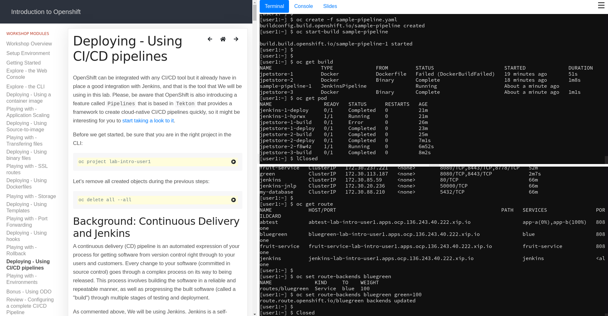

Introduction to OpenShift workshop
=====================

This tutorial will act as step-by-step guide in helping you to understand Openshift concepts. We will deploy applications on top of OpenShift following different methods and in between We will explore some of the key concepts while playing with those Apps. These are the modules that you will find in this guide:

<ol>
<li>Explore the Web Console</li>
<li>Explore the oc CLI</li>
<li>Deploying - Using a container image</li>
<li>Playing with - Application Scaling</li>
<li>Deploying - Using Source-to-image </li>
<li>Playing with - Transfering files</li>
<li>Deploying - Using binary files</li>
<li>Playing with - SSL routes</li>
<li>Deploying - Using Dockerfiles</li>
<li>Playing with - Storage</li>
<li>Deploying - Using Templates</li>
<li>Playing with - Port Forwarding </li>
<li>Deploying - Using hooks</li>
<li>Playing with - Rollback</li>
<li>Deploying - Using CI/CD pipelines</li>
<li>Playing with - Advanced Deployment Stragies</li>
<li>Bonus - Using ODO</li>
<li>Review - Configuring a complete CI/CD Pipeline</li>
</ol>

Deploying the workshop
=====================

You need to run this workshop in a working OpenShift Cluster. In order to install it clone (with submodules) and run the following commands:

*NOTE*: You have to be log in to the OpenShift cluster from where you launch the installer, probably as clusteradmin if you want to run the workshop as multiuser 

`git clone --single-branch --branch master --recurse-submodules https://github.com/luisarizmendi/lab-ocp-intro.git`

`cd lab-ocp-intro`

`./workshop/launch-workshop.sh`

SINGLE and MULTIUSER modes
=====================

This workshop can work in two modes: single user or multiuser. If you run it as multiuser (default) you will need a dynamic persistent volume storage and run this command. If you run the prerequistes as part of this command (with --prerequisites) be aware that there is a nfs-autoprovisioner module (under ./launch/prerequisites) that will be run and that will configure the unsupported NFS dynamic provisioner but, if you decide to run it, YOU WILL NEED TO PREPARE THE FILES WITH THE RIGHT NFS IP ADDRESS AND PATH.

Also take into account that, even if you don't run the prerequisites, you will NEED TO BE LOG IN AS CLUSTER ADMIN in OpenShift since multiple projects and users will be created

Single user workshop is more restricted since it uses a serviceaccount instead of the "real" ocp user.

If you want to run the single add the --singleuser in the command, like this: launch-workshop.sh --singleuser
