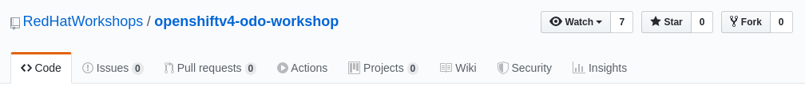
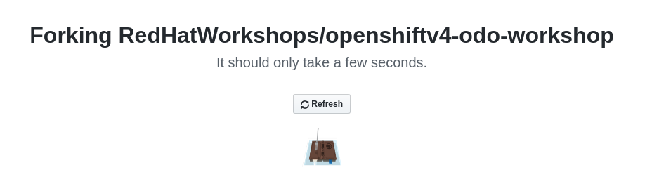
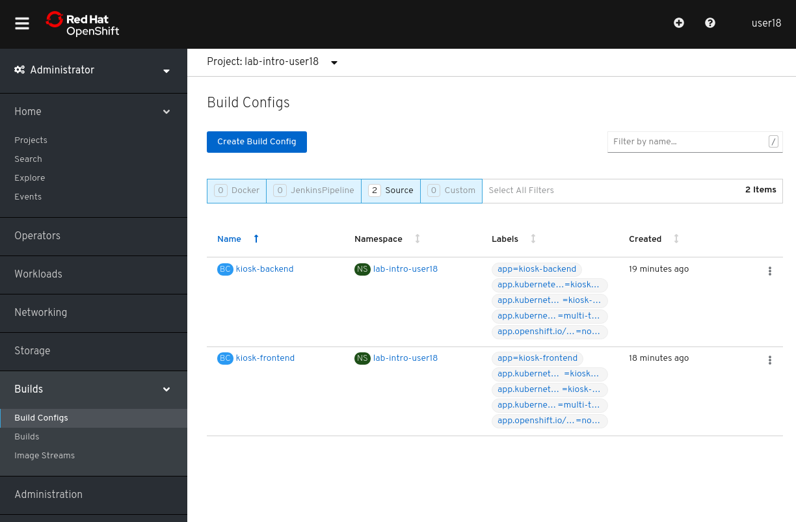
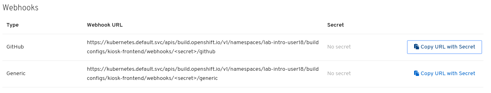
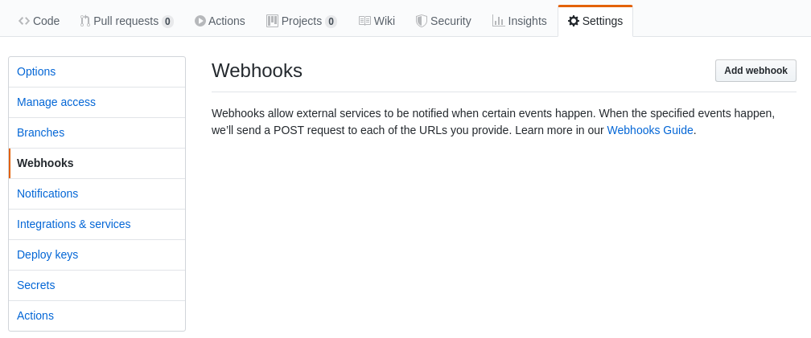
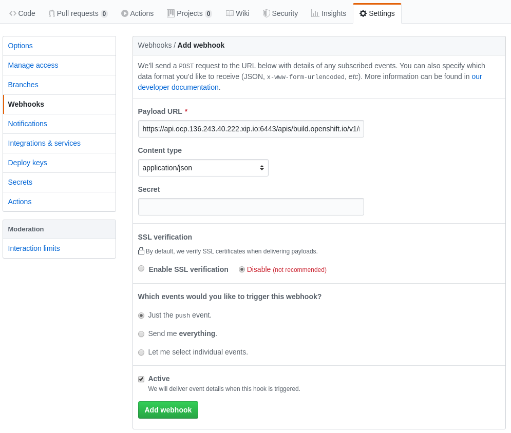
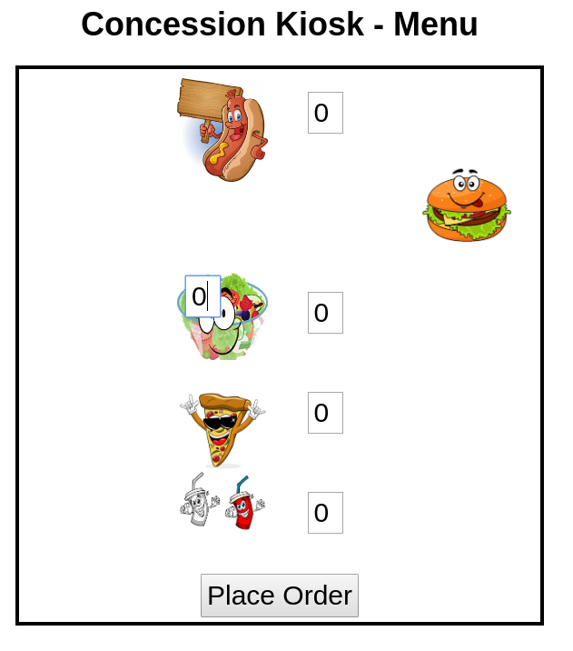
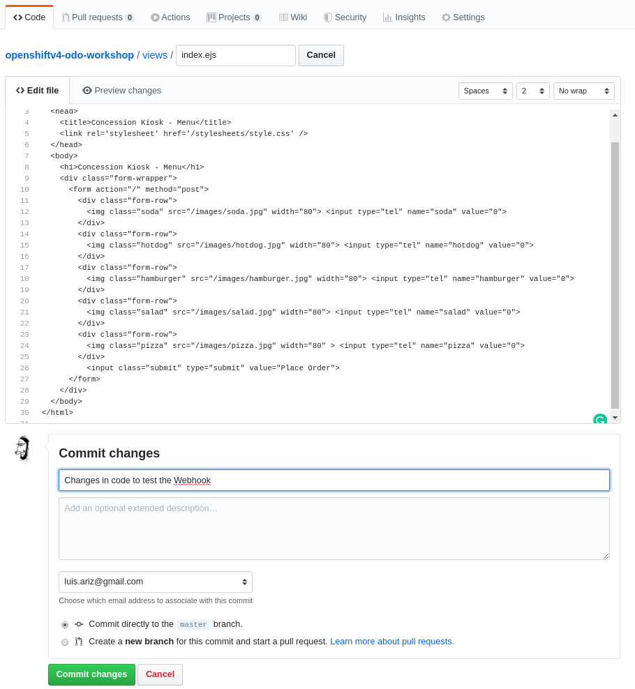
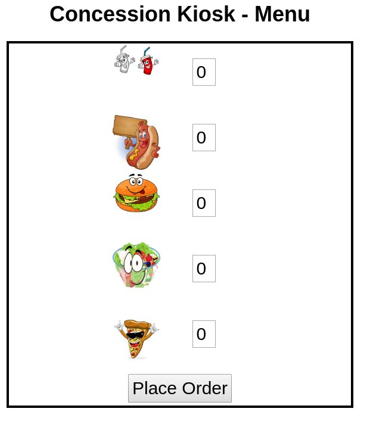

We learned how to deploy an application from it's container image, from the source, from a binary and from a custom container image build but all of those deployments had something in common, a human being (We) trigger the build and deployment of the application. What We will show here is how 
OpenShift offers several mechanisms to trigger the automatic deployment of applications. In this Lab we will demonstrate the deployment of a very simple application via a GitHub Web Hook trigger.

Instead of deploying a simple application, We will deploy a multi-tier application so we can take the opportunity to review how to link the different microservices.

Before we get started, be sure that you are in the right project in the CLI:

[source,bash,role="execute"]
----
oc project lab-intro-{{ username }}
----

Let's remove all created objects during the previous steps:

[source,bash,role="execute"]
----
oc delete all --all
----

## Fork the GitHub repository

The application used for this example is a three-tier Node.js application on Red Hat OpenShift. The example application is a concession kiosk, used to streamline the process of placing concession orders. The user will place an order via the Front-End web application. The order information will be saved in a MongoDB database, and then the user will be given an order number. Once their order number is called, users can go to the concession window to pay and receive their food. While deploying the application We will include in the backend component the configuration referencing to the MongoDB database, and in the frontend the reference to the backend.

image::../images/kiosk.png[]

The source code can be found here:

* Backend: https://github.com/RedHatWorkshops/openshiftv4-odo-workshop-backend

* Frontend: https://github.com/RedHatWorkshops/openshiftv4-odo-workshop

For this lab We will want to first "fork" one of those repositories so we can make changes to the code. Let's fork the Frontend component. Log in to your Github account and go to the repository. In the upper right corner of the page, click on the "Fork" icon to fork the repository.

This will give you a copy of the code that you can manage and modify. 

Your will use this repository in the next step when you create the Frontend of the new application in your project.

## Deploy the Application
We will start by deploying the MongoDB database, then the application backend and finally the Frontend.

Regarding the forked repository, since we are not touching the backend code we can use the original GitHub reposotiry without having to fork it. It will be a command close to this example:

----
oc new-app https://github.com/RedHatWorkshops/openshiftv4-odo-workshop-backend.git --name=kiosk-backend 
----

But while deploying the Frontend remember to use your GitHub forked repository, your command should be something like this example:

----
oc new-app https://github.com/<your_github_username>/openshiftv4-odo-workshop.git --name=kiosk-frontend
----

Let's start with the Database

### Deploy the Database

You can deploy MongoDB using command line as follows:

[source,bash,role="execute"]
----
oc new-app mongodb-ephemeral --name=mongodb \
-l app.openshift.io/runtime=mongodb,\
app.kubernetes.io/part-of=multi-tiered-app
----

* `app.openshift.io/runtime=mongodb` is a label to display runtime icon on webconsole

* `app.kubernetes.io/part-of=multi-tiered-app` displays the deployment as part of an application grouping called `multi-tiered-app` on web console

Or you can also use WebConsole and select `Mongodb Ephemeral` from the developer catalog

image::../images/multitiered1.png[image,1000]

This will deploy the database and also create a secret that has credentials to connect to the database. Note the name of that secret as we will be using that with our backend application to connect to the database.

----
..
..
..
--> Creating resources with label app.kubernetes.io/part-of=multi-tiered-app,app.openshift.io/runtime=mongodb ...
    secret "mongodb" created # <1>
    service "mongodb" created # <2>
    deploymentconfig.apps.openshift.io "mongodb" created # <3>
--> Success
    Application is not exposed. You can expose services to the outside world by executing one or more of the commands below:
     'oc expose svc/mongodb' 
    Run 'oc status' to view your app.
----

<1> this is the database secret that we will inject into our backend app later
<2> this is the database service
<3> this is the deploymentconfig

Once deployed, you have the first tier of the 3-tier app deployed that shows up on the web console as

image::../images/multitiered4.png[image,200]

### Deploy the Backend

Now we will deploy the backend application by running the following commands.

[NOTE]
You can deploy this from web console by browsing through the the catalog and supplying the source code URL as input and selecting the runtime.

Deploy the backend from the original GitHub repository:

[source,bash,role="execute"]
----
oc new-app https://github.com/RedHatWorkshops/openshiftv4-odo-workshop-backend.git \
--name=kiosk-backend \
-l app.openshift.io/runtime=nodejs,\
app.kubernetes.io/part-of=multi-tiered-app
----

* `app.openshift.io/runtime=nodejs` is a runtime label to display icon on web console
* `app.kubernetes.io/part-of=multi-tiered-app` is a label to make app part-of application group

You can apply an annotation to visually show connection to the database on the web console. 

[source,bash,role="execute"]
----
oc annotate dc/kiosk-backend app.openshift.io/connects-to=mongodb
----

The first command will start openshift S2I build for your backend application. The build will run  for a few mins. 

You can watch build logs either using web console or via command line:

[source,bash,role="execute-2"]
----
<ctrl-c>
oc logs build/kiosk-backend-1
----

In the meanwhile, we will patch the deployment configuration to add environment variables that reference the database secret. *This is required for your backend application to make a service connection to the database*.

[source,bash,role="execute"]
----
oc patch dc/kiosk-backend --type='json' -p='[{"op": "add", "path": "/spec/template/spec/containers/0/env", "value": [ { "name": "username", "valueFrom": {  "secretKeyRef": { "name": "mongodb", "key": "database-user" }  } },{ "name": "password", "valueFrom": {  "secretKeyRef": { "name": "mongodb", "key": "database-password" }  } },{ "name": "database_name", "valueFrom": {  "secretKeyRef": { "name": "mongodb", "key": "database-name" }  } },{ "name": "admin_password", "valueFrom": {  "secretKeyRef": { "name": "mongodb", "key": "database-admin-password" }  } } ] }]'
----

Applying this patch will add the following to the deployment configuration. You can check the deployment configuration by running `oc get dc/kiosk-backend -o yaml`.

----
    spec:
      containers:
      - env:
        - name: username
          valueFrom:
            secretKeyRef:
              key: database-user
              name: mongodb
        - name: password
          valueFrom:
            secretKeyRef:
              key: database-password
              name: mongodb
        - name: database_name
          valueFrom:
            secretKeyRef:
              key: database-name
              name: mongodb
        - name: admin_password
          valueFrom:
            secretKeyRef:
              key: database-admin-password
              name: mongodb

----

This configuration creates the secret mappings and assigns respective values from the secrets to the environment variables when the container starts running. 

[cols=2*, options=header]
|===
|env variable
|key from secret

|username
|database-user

|password
|database-password

|database_name
|database-name

|admin_password
|database-admin-password
|===

Once deployed, you have the 1st and 2nd tiers of the 3-tier app deployed that shows up on the web console as

image::../images/multitiered5.png[image,350]

### Deploy the Frontend

Let us now deploy the frontend component. While creating the frontend we will also link this to the backend component that we deployed in the last step by passing the environment variables that point to the backend service.

[NOTE]
You can deploy this from web console by browsing through the the catalog and supplying the source code URL as input and selecting the runtime.

CAUTION: Remember to use the forked repository from your GitHub account here

This is an example of the deploy command that you should run. It's an example because you have to use your own GitHub account. Please take a look to the environment variables configured with `-e <ENV>=<VALUE>` during the deployment (no need to patch the deployment here afterwards like in the backend example since We are adding the information here)

Include your GitHub username in a variable to make it easier:

----
GITHUB_USER=<your GitHub username>
----

[source,bash,role="execute"]
----

oc new-app https://github.com/${GITHUB_USER}/openshiftv4-odo-workshop.git \
--name=kiosk-frontend \
-l app.openshift.io/runtime=nodejs,\
app.kubernetes.io/part-of=multi-tiered-app \
-e COMPONENT_BACKEND_HOST=$(oc get svc kiosk-backend --template={{.spec.clusterIP}}) \
-e COMPONENT_BACKEND_PORT=$(oc get svc kiosk-backend  -o=jsonpath='{ .spec.ports[?(@.name == "8080-tcp")].targetPort }')
----

* `COMPONENT_BACKEND_HOST` is an env variable that points to backend service
* `COMPONENT_BACKEND_PORT` is an env variable that points to backend service port

You can also annotate the deployment to show the relationship in the Web Console.

[source,bash,role="execute"]
----
oc annotate dc/kiosk-frontend app.openshift.io/connects-to=kiosk-backend
----

NOTE: `oc get svc kiosk-backend --template={{.spec.clusterIP}}` provides service name and 
`oc get svc kiosk-backend  -o=jsonpath='{ .spec.ports[?(@.name == "8080-tcp")].targetPort }'` gives you the service port. You can find these values by running `oc get svc kiosk-backend` directly and substitute those values. The above line shows how you can script it all into one line. 

### Test the Application

Create a route to expose your frontend component via openshift router.

[source,bash,role="execute"]
----
oc expose svc kiosk-frontend
----

[NOTE] 
We did not expose our backend application to create an openshift route. This is because it would be accessed only within the openshift cluster. So, you would only want to expose those services that need to be accessed from outside the cluster.

Once done, you have all 3 tiers of your app deployed that shows up on the web console as

image::../images/multitiered6.png[image,400]

Now test the application by accessing its URL. You can get the URL by running 

[source,bash,role="execute"]
----
oc get route kiosk-frontend --template={{.spec.host}}
----

http://kiosk-frontend-lab-intro-{{ username }}.{{ cluster_subdomain }}

Test in the browser, you will see this screen.Place and order and confirm that you are getting an order number with order details:

image::../images/multitiered2.png[image,400]

image::../images/multitiered3.png[image,400]

## Configure the Web Hook

OpenShift offers several mechanisms to trigger the automatic deployment of applications. Here, as metioned earlier, we will demonstrate the GitHub Web Hook trigger. Webhook triggers allow you to trigger a new build by sending a request to the OpenShift Container Platform API endpoint. When the push events are processed, the OpenShift Container Platform master host confirms if the branch reference inside the event matches the branch reference in the corresponding BuildConfig. If so, it then checks out the exact commit reference noted in the webhook event on the OpenShift Container Platform build. If they do not match, no build is triggered.

At this point you have the frontend application with one single replica running inside a container in OpenShift. We used the source retrieved from the git repository and layered it using a builder or image stream strategy, so let's continue from here.

### Retrieve and configure the OpenShift Web Hook URL

The webhook definition must then reference the secret. The secret ensures the uniqueness of the URL, preventing others from triggering the build. The value of the key will be compared to the secret provided during the webhook invocation.

[NOTE]
`oc new-app` and oc `new-build` will create GitHub and Generic webhook triggers automatically, but any other needed webhook triggers must be added manually

You can review the secret created by taking a look to the buildconfig of the frontend component:

[source,bash,role="execute"]
----
oc get bc/kiosk-frontend -o yaml 
----

You should find something like this:

----
..
..
  triggers:
  - github:
      secret: ZFhff0POJxJRPS-klb2F
    type: GitHub
..
..
----

[NOTE]
If you used the Web Console to create the frontend component you will find some differences, for example the buildconfig does not include the secret, but a pointer to a secret created outside the buildconfig, for example:

----
..
..
  triggers:
    - type: Generic
      generic:
        secretReference:
          name: from-workshop-generic-webhook-secret
..
..
----

Then if you check that secret, you will see something like this:

----
kind: Secret
apiVersion: v1
metadata:
  name: from-workshop-github-webhook-secret
  namespace: lab-intro-user18
data:
  WebHookSecretKey: ZjllNmYxMzc2N2I4ZTkwNQ==
type: Opaque
----

Let's continue after this remark on the differences between deploying with CLI and Web Console.

We will need the URL to trigger the build, you can find it in the Web Console or using the CLI

From the [Web Console]({{ console_url }}), in the "Administrator" view, go to Build Configs:

Then select the build config for the frontend component. Once inside the object definition, scroll down to the buttom and you will see the *Webhooks* section. For the *GitHub* type click on the *Copy URL with Secret" link. You will need this URL for next step.

Taking a look to the clipboard content you will see something close to this:

----
https://kubernetes.default.svc/apis/build.openshift.io/v1/namespaces/lab-intro-user18/buildconfigs/kiosk-frontend/webhooks/ZFhff0POJxJRPS-klb2F/github
----

As you can see, the URL includes the secret that we reviewed before, but *in this case* the "host" of the API endpoint is internal to OpenShift and, since we want GitHub to connect to our API endpoint, We will need to change it. I've found that this happens when the public API endpoint cannot be resolved while creating the buildconfig.

This right URL should be look like in this example:

----
https://api.ocp.136.243.40.222.xip.io:6443/apis/build.openshift.io/v1/namespaces/lab-intro-user18/buildconfigs/kiosk-frontend/webhooks/ZFhff0POJxJRPS-klb2F/github
----

If you want to use the CLI, describe the buildconfig of the frontend and look for the Webhook:

[source,bash,role="execute"]
----
oc describe bc/kiosk-frontend | grep -A 1 Git
----

You should see something like this:

----
$ oc describe bc/kiosk-frontend | grep -A 1 Git
Webhook GitHub:
        URL:    https://172.30.0.1:443/apis/build.openshift.io/v1/namespaces/lab-intro-{{ username }}/buildconfigs/kiosk-frontend/webhooks/<secret>/github
----

Note that here the URL has the secret hidden.

### Configure GitHub repository Web Hook

* Login to your GitHub account.
* Navigate to the forked repository you used to create the application.
* Click on Settings.
* Click on Webhooks.

* Click on the *Add webhook* button.
* Add the recently copied Web Hook URL from OpenShift into the "Payload URL" box.
* Change the Content-type as ``application/json''
* Let the "secret" empty
* Click on the *Disable SSL Verification* button.
* Confirm by adding the *Add Webhook* button in green at the bottom of the page.

[NOTE]
The secret used in the webhook trigger configuration is not the same as secret field you encounter when configuring webhook in GitHub UI. The former is to make the webhook URL unique and hard to predict, the latter is an optional string field used to create HMAC hex digest of the body, which is sent as an X-Hub-Signature header.

You should see a message from GitHub stating that your webhook was successfully configured.

Now, whenever you push a change to your GitHub repository, a new build will automatically start, and upon a successful build a new deployment will start.

Given a file containing a valid JSON payload, such as payload.json, you can manually trigger the webhook with curl similar to this example:

----
$ curl -H "X-GitHub-Event: push" -H "Content-Type: application/json" -k -X POST --data-binary @payload.json https://<api_public_endpoint>>:<port>/oapi/v1/namespaces/lab-intro-{{ username }}/buildconfigs/kiosk-frontend/webhooks/<secret>/github
----

The -k argument is only necessary if your API server does not have a properly signed certificate.

### Change the code and push the changes to GitHub

Once we push the new code a new build will be trigger, so first let's review the current status:

[source,bash,role="execute"]
----
oc get builds
----

The output should show this:

----
$ oc get builds
NAME                          TYPE     FROM          STATUS     STARTED          DURATION
kiosk-backend-1               Source   Git@c08f65c   Complete   4 hours ago      59s
kiosk-frontend-1              Source   Git@caf228f   Complete   4 hours ago      1m19s
----

Now let's change the code. We are going to make two changes to solve this:

* We have detected that when using big screens, if you maximize your web browser the second row (the one with the hamburger) is not shown correctly, something like this:

* Business has detected that people trend to forget to order the drinks, so we have been asked to change the order and put the drinks in the first place

We have to make two changes but both must be done in the same file: views/index.ejs. In order to solve the problem with the table, We are going to reduce the image size from 100 to 80. We also have to remember to change the order and put the "soda" raw in the first place, the code will be like this:

----
 
<!DOCTYPE html>
<html>
  <head>
    <title>Concession Kiosk - Menu</title>
    <link rel='stylesheet' href='/stylesheets/style.css' />
  </head>
  <body>
    <h1>Concession Kiosk - Menu</h1>
    

      <form action="/" method="post">
        

           <input type="tel" name="soda" value="0">
        

        

           <input type="tel" name="hotdog" value="0">
        

        

           <input type="tel" name="hamburger" value="0">
        

        

           <input type="tel" name="salad" value="0">
        

        

           <input type="tel" name="pizza" value="0">
        

          <input class="submit" type="submit" value="Place Order">
      </form>
    

  </body>
</html>
----

We can clone the git repository in the CLI or, as in this example, just go to the GitHub web console and make there the change:

Once we have clicked "Commit", check again the builds:

[source,bash,role="execute"]
----
oc get builds
----

An example of the output:

----
$ oc get builds
NAME                          TYPE     FROM          STATUS     STARTED             DURATION
kiosk-backend-1               Source   Git@c08f65c   Complete   4 hours ago         59s
kiosk-frontend-1              Source   Git@caf228f   Complete   4 hours ago         1m19s
kiosk-frontend-2              Source   Git@68cb640   Pending
----

You can notice how a new build is Pending and eventually finish, then the new image will be deployed:

[source,bash,role="execute"]
----
oc get pods
----

Check that a new POD is there:

----
$ oc get pod
NAME                                READY   STATUS      RESTARTS   AGE
kiosk-backend-1-build               0/1     Completed   0          3h43m
kiosk-backend-1-deploy              0/1     Completed   0          3h42m
kiosk-backend-1-zqr9v               1/1     Running     0          3h42m
kiosk-frontend-1-build              0/1     Completed   0          3h43m
kiosk-frontend-1-deploy             0/1     Completed   0          3h41m
kiosk-frontend-2-8bktw              1/1     Running     0          48s
kiosk-frontend-2-build              0/1     Completed   0          114s
kiosk-frontend-2-deploy             0/1     Completed   0          58s
mongodb-1-9kc77                     1/1     Running     0          3h43m
mongodb-1-deploy                    0/1     Completed   0          3h43m
----

... and you will be able to access the application and check the changes that We made accessing again to the URL (maybe you have to clean the cache):

http://kiosk-frontend-lab-intro-{{ username }}.{{ cluster_subdomain }}

