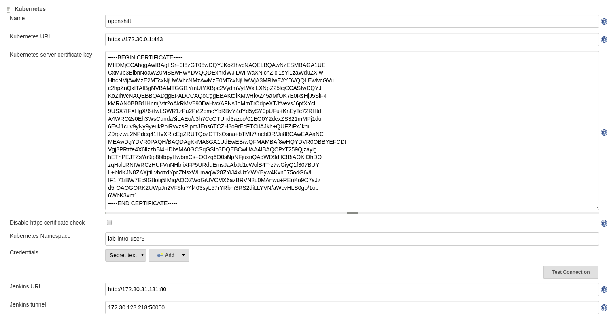
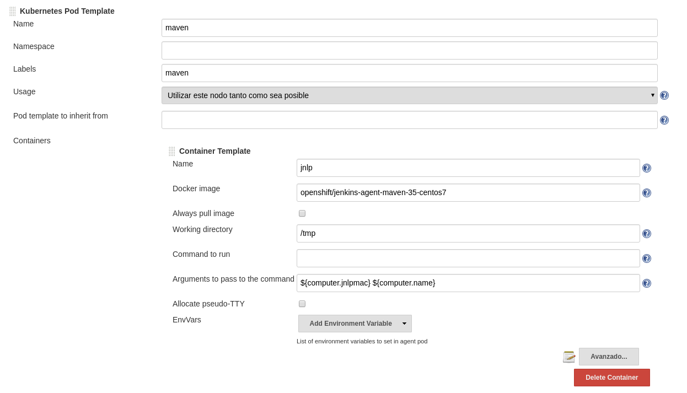
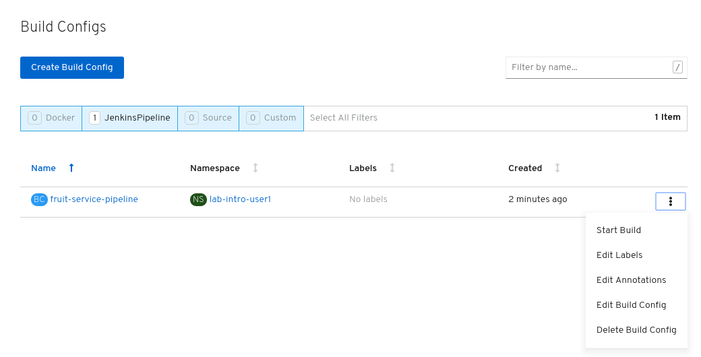
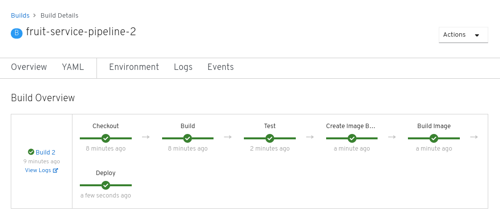
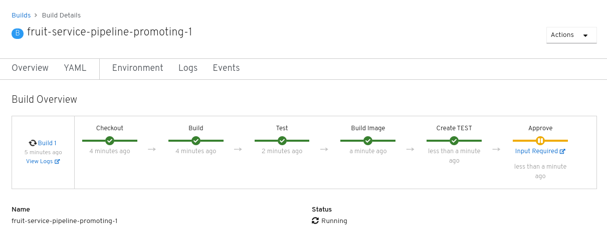
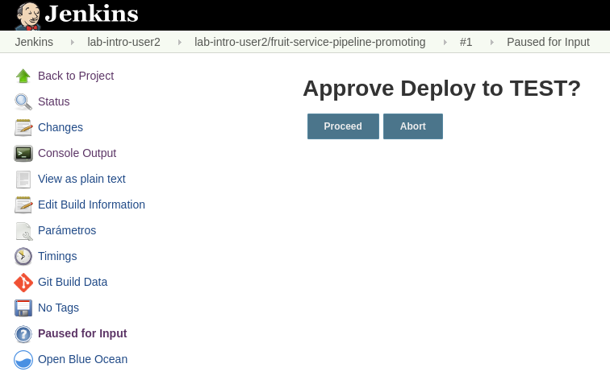


  


OpenShift can be integrated with any CI/CD tool but it already have in place a good integration with Jenkins, and that is the tool that We will be using in this lab. Please, be aware that OpenShift is also introducing a feature called `Pipelines` that is based in `Tekton` that provides a framework to create cloud-native CI/CD pipelines quickly, so it might be interesting for you to link:https://www.openshift.com/learn/topics/pipelines[start taking a look to it].

Before we get started, be sure that you are in the right project in the CLI:

[source,bash,role="execute"]
----
oc project lab-intro-{{ username }}
----

Let's remove all created objects during the previous steps:

[source,bash,role="execute"]
----
oc delete all --all
----

## Background: Continuous Delivery and Jenkins

A continuous delivery (CD) pipeline is an automated expression of your process for getting software
from version control right through to your users and customers. Every change to your software (committed in source control) goes through a complex process on its way to being released. This process involves building the software in a reliable and repeatable manner, as well as progressing the built software (called a "build") through multiple stages of testing and deployment.

As commented above, We will be using Jenkins. Jenkins is a self-contained, extensible, open source automation server which can be used to automate all sorts of tasks such as building, testing, and deploying software. Jenkins provides support for all popular source code management systems (SCM) , popular build tools, as well as testing frameworks and report generators. The latest major release of Jenkins included a powerful Continuous Delivery pipeline support using a Groovy Domain Specific Language (DSL) which is referred to as Pipeline as Code.

Jenkins provides an extensible set of tools for modeling simple-to-complex delivery pipelines "as code" via the link:https://jenkins.io/doc/book/pipeline/syntax[Pipeline domain-specific language (DSL)] syntax. OpenShift provides also an link:https://github.com/openshift/jenkins-client-plugin[OpenShift Jenkins Pipeline DSL] for interacting with the platform from within a Jenkins pipeline in a fluent manner. The definition of a Jenkins Pipeline is written into a text file (called a Jenkinsfile) which
in turn can be committed to a project’s source control repository. This is the foundation of
"Pipeline-as-code"; treating the CD pipeline a part of the application to be versioned
and reviewed like any other code.

Since the build can be started and managed from OpenShift, you may be wondering how Jenkins knows when to execute the pipeline or how OpenShift knows the state of the pipeline execution. This is accomplished via an additional Jenkins plugin called the OpenShift Sync plugin. As the name implies, this plugin is responsible for synchronizing state between OpenShift and Jenkins.

When a Pipeline BuildConfig is created, the sync plugin will create a new job in Jenkins to represent the BuildConfig. When a build is started from the BuildConfig, the sync plugin will start the job in Jenkins to perform the execution. And as the job executes within Jenkins, the sync plugin will update the build object in OpenShift with annotation metadata about the state of the execution. This metadata enables the OpenShift web console to display the state of the execution including what pipeline stage is being executed, success or failure of the stage, and how long it has been running.

This plugin is included in the Jenkins image provided with OpenShift, but it can also be installed to existing Jenkins servers to allow for link:https://blog.openshift.com/using-openshift-pipeline-plugin-external-jenkins/[integration to external Jenkins deployments].

## Deploy the Database for the Application

We will deploy an application that needs a data base, so you have to deploy one postgresql:

[source,bash,role="execute"]
----
oc new-app -e POSTGRESQL_USER=luke -ePOSTGRESQL_PASSWORD=secret -ePOSTGRESQL_DATABASE=my_data centos/postgresql-10-centos7 --name=my-database
----

Wait for the database to be up and running.

## Deploy Jenkins

If We want to use Jenkins, We need to deploy Jenkins. If you search for apps with the Jenkins on its name, you probably will find:

* Templates to be used by running `oc new-app --template=<template>`
** jenkins-ephemeral
** jenkins-ephemeral-monitored
** jenkins-persistent
** jenkins-persistent-monitored

* Image streams be used by running `oc new-app --image-stream=<image-stream> [--code=<source>]`
** jenkins
** jenkins-agent-maven
** jenkins-agent-nodejs

* Docker Images be used by running `oc new-app --docker-image=<docker-image> [--code=<source>]`
** jenkins

[source,bash,role="execute"]
----
oc new-app --search jenkins
----

Output:

----
$ oc new-app --search jenkins
Templates (oc new-app --template=<template>)
-----
jenkins-ephemeral
  Project: openshift
  Jenkins service, without persistent storage.

WARNING: Any data stored will be lost upon pod destruction. Only use this template for testing.
jenkins-ephemeral-monitored
  Project: openshift
  Jenkins service, without persistent storage.

WARNING: Any data stored will be lost upon pod destruction. Only use this template for testing.
jenkins-persistent
  Project: openshift
  Jenkins service, with persistent storage.

NOTE: You must have persistent volumes available in your cluster to use this template.
jenkins-persistent-monitored
  Project: openshift
  Jenkins service, with persistent storage.

NOTE: You must have persistent volumes available in your cluster to use this template.

Image streams (oc new-app --image-stream=<image-stream> [--code=<source>])
-----
jenkins
  Project: openshift
  Tags:    2, latest
jenkins-agent-maven
  Project: openshift
  Tags:    latest, v4.0
jenkins-agent-nodejs
  Project: openshift
  Tags:    latest, v4.0

Docker images (oc new-app --docker-image=<docker-image> [--code=<source>])
-----
jenkins
  Registry: Docker Hub
  Tags:     latest
----

Let's deploy the template with the Jenkins using ephemeral storage

[source,bash,role="execute"]
----
oc new-app jenkins-ephemeral
----

When the POD is running get the route and check your access 

[source,bash,role="execute"]
----
oc get pod
----

[source,bash,role="execute"]
----
oc get route
----

If you don't get the Jenkis log in page, wait some time until it finish deploying and try again.

https://jenkins-lab-intro-{{ username }}.{{ cluster_subdomain }}

You will have to use your OpenShift credentials and you will need to authorize the Jenkins access

image::../images/authorize_access.png[]

The template that We used to deploy jenkins already configured the Jenkins-OpenShift integration, as you can see if you check the system configuration

### Configure Jenkins Agents

Although adding more CPU and memory to the Jenkins container helps to some extent, quite soon you would reach a breaking point which stops you from running more Jenkins builds. Fortunately Jenkins is built with scalability in mind and supports a master-slave architecture to allow running many simultaneous builds on slave nodes (agents) and allow Jenkins master to coordinate these builds. This distributed computing model will allow the Jenkins master to remain responsive to users, while offloading automation execution to the connected slave. This master-slave architecture also allows creating separate slaves with specific build tools installed such as Maven, NodeJS, etc instead of having all the build tools installed on the master Jenkins.

The official Jenkins image provided by OpenShift includes the pre-installed Kubernetes plug-in that allows Jenkins slaves to be dynamically provisioned on multiple container hosts using Kubernetes and OpenShift. You can configure a new agent using the link:https://blog.openshift.com/jenkins-slaves-in-openshift-using-an-external-jenkins-environment/[Jenkins UI] but the Jenkins already have an agent called `maven` (that We will be using in our Pipeline example) and another `nodejs`

## Create the pipeline BuildConfig

The next thing to be created is the pipeline buildconfig. We already used buildconfigs when deploying with source-to-image feature (We also used "docker build" stragegy when shown how to deploy an application with a custom Dockerfile ), but actually never describe what a buildconfig is. A build configuration describes a single build definition and a set of triggers for when a new build is created. Build configurations are defined by a BuildConfig, which is a REST object that can be used in a POST to the API server to create a new instance.

A build configuration, or BuildConfig, is characterized by a build strategy and one or more sources. The strategy determines the process, while the sources provide its input.

There are several strategies:

* *Docker build*: The Docker build strategy invokes the docker build command, and it expects a repository with a Dockerfile and all required artifacts in it to produce a runnable image.

* *Source-to-Image*: Source-to-Image (S2I) is a tool for building reproducible, Docker-formatted container images. It produces ready-to-run images by injecting application source into a container image and assembling a new image. The new image incorporates the base image (the builder) and built source and is ready to use with the buildah run command. S2I supports incremental builds, which re-use previously downloaded dependencies, previously built artifacts, etc.

* *Custom build*: The Custom build strategy allows developers to define a specific builder image responsible for the entire build process. Using your own builder image allows you to customize your build process. A Custom builder image is a plain Docker-formatted container image embedded with build process logic, for example for building RPMs or base images. Custom builds run with a very high level of privilege and are not available to users by default. Only users who can be trusted with cluster administration permissions should be granted access to run custom builds.

* *Pipeline*: The Pipeline build strategy allows developers to define a Jenkins pipeline for execution by the Jenkins pipeline plug-in. The build can be started, monitored, and managed by OpenShift Container Platform in the same way as any other build type. Pipeline workflows are defined in a Jenkinsfile, either embedded directly in the build configuration, or supplied in a Git repository and referenced by the build configuration.

As you can imagine We will configure the pipeline strategy, as you can see below in the template snippet We use the `jenkinsPipelineStrategy`. When you create using this strategy, you need to include the Jenkins pipeline configuration file.

The development of Jenkins pipeline scripts with link:https://jenkins.io/doc/book/pipeline/syntax[Pipeline domain-specific language (DSL)] is out of the scope of this workshop but We will configure one very simple for our test

Let's create the example BuildConfig with the `jenkinsPipelineStrategy` and the Jenkins file with the pipeline definition

[NOTE]
Please note that I am creating the YAML file from a cat here, so the variables `${VAR}` here are included as `\${VAR}` so in the actual YAML appear as `${VAR}`. That because otherwise the bash will interpret that as a bash variable (that does not exist)

[source,bash,role="execute"]
----
cat >fruit-service-pipeline.yaml<<EOF
apiVersion: build.openshift.io/v1
kind: BuildConfig
metadata:
  name: fruit-service-pipeline
spec:
  strategy:
    jenkinsPipelineStrategy:
      jenkinsfile: |-
        // Don't forget to run the commands to create the dev project, and grant the needed roles to the service accounts
                
        def BUILD_NAME = APP_NAME
            
        //def mvnCmd = "mvn -s ./nexus_openshift_settings.xml"
        def mvnCmd = "mvn"
        pipeline {
          agent {
            label 'maven'
          }
          stages {
            stage('Checkout') {
              steps {
                git url: "\${GIT_URL}", branch: "\${GIT_REF}"
              }
            }
            
            stage('Build') {
                steps {
                    dir("\${CONTEXT_DIR}") {
                        sh "\${mvnCmd} clean package -DskipTests -Popenshift"
                    }
                }
            }
            
            stage('Test') {
                steps {
                    dir("\${CONTEXT_DIR}") {
                        sh "\${mvnCmd} test"
                    }
                }
            }
            
                                
            stage('Create Image Builder') {
              when {
                expression {
                  openshift.withCluster() {
                    return !openshift.selector("bc", "\${BUILD_NAME}").exists();
                  }
                }
              }
              steps {
                script {
                  openshift.withCluster() {
                    openshift.newBuild("--name=\${BUILD_NAME}", "--image-stream=\${BUILD_IMAGE_STREAM}", "--binary")
                  }
                }
              }
            }
            stage('Build Image') {
              steps {
                script {
                  dir("\${CONTEXT_DIR}") {
                    openshift.withCluster() {
                        openshift.selector("bc", "\${BUILD_NAME}").startBuild("--from-file=./target/\${JAR_NAME}-\${APP_VERSION}.jar", "--wait")
                    }      
                  }
                }
              }
            }
            stage('Deploy') {
              when {
                expression {
                  openshift.withCluster() {
                    return !openshift.selector('dc', "\${APP_NAME}").exists()
                  }
                }
              }
              steps {
                script {
                  openshift.withCluster() {
                    openshift.newApp("\${BUILD_NAME}:latest", "--name=\${APP_NAME} -e DB_USERNAME=luke -e DB_PASSWORD=secret -e JAVA_OPTIONS=-Dspring.profiles.active=openshift").narrow('svc').expose()
                    def liveness = openshift.raw( "set probe dc/\${APP_NAME} --liveness --get-url=http://:8080/actuator/health --initial-delay-seconds=180" )
                    echo "After set probe liveness: \${liveness.out}"
                    def readiness = openshift.raw( "set probe dc/\${APP_NAME} --readiness --get-url=http://:8080/api/fruits --initial-delay-seconds=10" )
                    echo "After set probe readiness: \${readiness.out}"
                    def partOfLabel = openshift.raw( "label dc/\${APP_NAME} app.kubernetes.io/part-of=\${APP_NAME}-app" )
                    echo "After label part-of partOfLabel: \${partOfLabel.out}"
                  }
                }
              }
            }
          }
        }
      env:
        - name: MAVEN_OPTS
          value: >-
            -Dsun.zip.disableMemoryMapping=true -Xms20m
            -Djava.security.egd=file:/dev/./urandom
            -XX:+UnlockExperimentalVMOptions 
            -Dsun.zip.disableMemoryMapping=true'
        - name: JAR_NAME
          value: "fruit-service"
        - name: APP_NAME
          value: "fruit-service"
        - name: APP_VERSION
          value: "1.0.0"
        - name: GIT_URL
          value: "https://github.com/cvicens/spring-boot-fruit-service.git"
        - name: GIT_REF
          value: "master"
        - name: CONTEXT_DIR
          value: "."
        - name: BUILD_IMAGE_STREAM
          value: "openshift/redhat-openjdk18-openshift:1.4"
        - name: JOB_BASE_NAME
          value: "fruit-service-job"
    type: JenkinsPipeline
EOF
----

The Jenkins file included in this buildconfig has the following stages:

. Checkout: Clone the Git repository

. Build: Use maven to compile the code creting a JAR file

. Test: Use maven to run the Unit test

. Create Image Builder: If it does not exist, it creates a new BuildConfig to deploy the JAR

. Build Image: Runs the BuildConfig injecting the binary JAR 

. Deploy: Deploy the new ImageStrem generated by the Build

Now that you understand what we are going to do, let's create the Pipeline BuildConfig

[source,bash,role="execute"]
----
oc create -f fruit-service-pipeline.yaml
----

## Running the Pipeline Build

You can start the build from the CLI (with the `oc start-build <buildconfig_name>`) or from the Web Console. 

Please, note that we are building the source with `maven` so it will take tome time (mostly the "Build" stage)

Let's do it with the CLI:

[source,bash,role="execute"]
----
oc start-build fruit-service-pipeline
----

Check that a new build of type JenkinsPipeline has been created 

[source,bash,role="execute"]
----
oc get build
----

Output

----
$ oc get build
NAME                       TYPE              FROM     STATUS     STARTED          DURATION
fruit-service-pipeline-1   JenkinsPipeline            Running   11 minutes ago

----

If you go to the Web Console and check What is going on that build, you will se the stages of the pipeline. At one point in time you will see that We reach the "build" stage, at this moment a new build is created.

[source,bash,role="execute"]
----
oc get build
----

Output

----
$ oc get build
NAME                       TYPE              FROM     STATUS     STARTED          DURATION
fruit-service-pipeline-1   JenkinsPipeline            Running   11 minutes ago
fruit-service-1            Source            Binary   Running   3 minutes ago     
----

After some time the pipeline finish its three stages

Then you will have the application deployed, this time by the Jenkins pipeline.

[source,bash,role="execute"]
----
oc get route
----

http://fruit-service-lab-intro-{{ username }}.{{ cluster_subdomain }}

## Promoting the application between environments

The CI/CD pipeline we created so far operate solely in a single environment (lab-intro-{{ username }} OpenShift project). In this lab, you will extend the pipeline to deploy the Fruit Service  to a DEV environment and then promote it to a "Production" environment.

It is essential to build the application and the container image only once and use the same container image throughout the pipeline to guarantee that the same container image is tested and verified to be of acceptable quality for deploying in the Prod environment.

### Creating the DEV and PROD environments

We are going to create two new project that will serve as test and production environments.

[source,bash,role="execute"]
----
oc new-project lab-intro-{{ username }}-test --display-name="Test"
----

[source,bash,role="execute"]
----
oc new-project lab-intro-{{ username }}-prod --display-name="Production"
----

Everytime that you create a new project, the CLI change to that project, so switch back to the original one:

[source,bash,role="execute"]
----
oc project lab-intro-{{ username }}
----

Jenkins will need to have access to these new projects, so let's give access to them to a serviceaccount that will be used:

[source,bash,role="execute"]
----
oc policy add-role-to-group edit system:serviceaccounts:lab-intro-{{ username }} -n lab-intro-{{ username }}-test
oc policy add-role-to-group edit system:serviceaccounts:lab-intro-{{ username }} -n lab-intro-{{ username }}-prod
----

If you don't run this the Jenkins pipeline will fail with this message 

----
Error from server (Forbidden): buildconfigs.build.openshift.io "tasks" is forbidden: User "system:serviceaccount:lab-intro-{{ username }}:jenkins" cannot create resource "buildconfigs/instantiatebinary" in API group "build.openshift.io" in the namespace "lab-intro-{{ username }}-prod"
----

### Creating the DEV and PROD databases

We are going to deploy in two additional environments and we would need to know what kind of access to the database we would like to have. For this example we will have completly independent databases, so We have to deploy one per project.

[NOTE]
Remember that if you are in the lab-intro-{{ username }} you can either jump into the test environment by running `oc project lab-intro-{{ username }}-test` and the the `oc` command, or just use the `-n` or `--namespace` with the name of the lab-intro-{{ username }}-test project (in that case you will stay in the lab-intro-{{ username }} project but you will get the objects from the lab-intro-{{ username }}-test project)

[source,bash,role="execute"]
----
oc new-app -n lab-intro-{{ username }}-test -e POSTGRESQL_USER=luke -ePOSTGRESQL_PASSWORD=secret -ePOSTGRESQL_DATABASE=my_data centos/postgresql-10-centos7 --name=my-database
----

[source,bash,role="execute"]
----
oc new-app -n lab-intro-{{ username }}-prod -e POSTGRESQL_USER=luke -ePOSTGRESQL_PASSWORD=secret -ePOSTGRESQL_DATABASE=my_data centos/postgresql-10-centos7 --name=my-database
----

### Application promotion
You can use an OpenShift template to deploy the application services in the Prod environment. The  template would then just pull the images needed and deploys and configures them in the Prod environment. However, you should build the images for once so that you can use them for the rest of the lab and deploy them in the production environment (it wouldn't make sense to build as many time as environments that you have).

When you build the image in an environment and you "copy" it to another environment it's called *Application Image Promotion*. Take into account that also the reason for doing so is to guarantee that the container image that runs in Prod environment is the same image that is running and has been tested in the Dev environment.

Images in OpenShift Container Platform are managed via a series of API objects. However, managing images are so central to application promotion that discussion of the tools and API objects most directly tied to images warrant separate discussion. Both manual and automated forms exist to assist you in managing image promotion (the propagation of images through your pipeline).

The promotion would depend if you are using a shared Registry between environments or if you use a pre-environment registy

#### When Staging Environments Share a Registry

When your staging environments share the same OpenShift Container Platform registry, for example if they are all on the same OpenShift Container Platform cluster, there are two operations that are the basic means of moving your images between the stages of your application promotion pipeline:

First, analogous to `podman tag` and `git tag`, the `oc tag` command allows you to update an OpenShift Container Platform image stream with a reference to a specific image. It also allows you to copy references to specific versions of an image from one image stream to another, even across different projects in a cluster.

Second, the `oc import-image` serves as a bridge between external registries and image streams. It imports the metadata for a given image from the registry and stores it into the image stream as an image stream tag. Various BuildConfigs and DeploymentConfigs in your project can reference those specific images.

An example of promoting an image using `oc tag`

----
$ oc tag <DEV_PROJECT>/myapp:latest <PROD_PROJECT>/myapp:prod
----

The above command promotes the container image which is the 'myapp' latest image build of the service in the Dev environment, to the Prod environment and names it 'myapp:prod'. As soon as the image is promoted to the Prod environment, the container gets automatically deployed. As new service container images are built, the Prod environment remains intact until you promote the new image builds to the Prod environment after sufficient testing.

#### When Staging Environments Use Different Registries

More advanced usage occurs when your staging environments leverage different OpenShift Container Platform registries. You can:

* Use the `podman` command in conjunction which obtaining the OpenShift Container Platform access token to supply into your `podman login` command.

* After being logged into the OpenShift Container Platform registry, use `podman pull`, `podman tag` and `podman push` to transfer the image.

* After the image is available in the registry of the next environment of your pipeline, use `oc tag` as needed to populate any image streams.

### Creating a new BuildConfig Pipeline

Instead of introducing modifications to the already created BuildConfig pipeline, We are going to create a new one.

[NOTE]
Remember that when creating the YAML file from a cat command, you have to change the variables `${VAR}` to `\${VAR}` to avoid being interpret as a bash variables.

[source,bash,role="execute"]
----
cat >fruit-service-pipeline-promoting.yaml<<EOF
apiVersion: build.openshift.io/v1
kind: BuildConfig
metadata:
  name: fruit-service-pipeline-promoting
spec:
  strategy:
    jenkinsPipelineStrategy:
      jenkinsfile: |-
        // Don't forget to run the commands to create the dev project, and grant the needed roles to the service accounts
                
        def BUILD_NAME = APP_NAME
            
        //def mvnCmd = "mvn -s ./nexus_openshift_settings.xml"
        def mvnCmd = "mvn"
        pipeline {
          agent {
            label 'maven'
          }
          stages {
            stage('Checkout') {
              steps {
                git url: "\${GIT_URL}", branch: "\${GIT_REF}"
              }
            }
            
            stage('Build') {
                steps {
                    dir("\${CONTEXT_DIR}") {
                        sh "\${mvnCmd} clean package -DskipTests -Popenshift"
                    }
                }
            }
            
            stage('Test') {
                steps {
                    dir("\${CONTEXT_DIR}") {
                        sh "\${mvnCmd} test"
                    }
                }
            }                            
            stage('Create Image Builder') {
              when {
                expression {
                  openshift.withCluster() {
                    openshift.withProject("\${TEST_PROJECT_NAME}") {
                      return !openshift.selector("bc", "\${BUILD_NAME}").exists();
                    }
                  }
                }
              }
              steps {
                script {
                  openshift.withCluster() {
                    openshift.withProject("\${TEST_PROJECT_NAME}") {
                      openshift.newBuild("--name=\${BUILD_NAME}", "--image-stream=\${BUILD_IMAGE_STREAM}", "--binary")
                    }
                  }
                }
              }
            }
            stage('Build Image') {
              steps {
                script {
                  dir("\${CONTEXT_DIR}") {
                    openshift.withCluster() {
                      openshift.withProject("\${TEST_PROJECT_NAME}") {
                          openshift.selector("bc", "\${BUILD_NAME}").startBuild("--from-file=./target/\${JAR_NAME}-\${APP_VERSION}.jar", "--wait")
                      }
                    }      
                  }
                }
              }
            }
            stage('Create TEST') {
              when {
                expression {
                  openshift.withCluster() {
                      openshift.withProject("\${TEST_PROJECT_NAME}") {
                        return !openshift.selector('dc', "\${APP_NAME}").exists()
                      }
                  }
                }
              }
              steps {
                script {
                  openshift.withCluster() {
                    openshift.withProject("\${TEST_PROJECT_NAME}") {
                        openshift.newApp("\${TEST_PROJECT_NAME}/\${BUILD_NAME}:latest", "--name=\${APP_NAME} -e DB_USERNAME=luke -e DB_PASSWORD=secret -e JAVA_OPTIONS=-Dspring.profiles.active=openshift").narrow('svc').expose()
                        def liveness = openshift.raw( "set probe dc/\${APP_NAME} --liveness --get-url=http://:8080/actuator/health --initial-delay-seconds=180" )
                        echo "After set probe liveness: \${liveness.out}"
                        def readiness = openshift.raw( "set probe dc/\${APP_NAME} --readiness --get-url=http://:8080/api/fruits --initial-delay-seconds=10" )
                        echo "After set probe readiness: \${readiness.out}"
                        def partOfLabel = openshift.raw( "label dc/\${APP_NAME} app.kubernetes.io/part-of=\${APP_NAME}-app" )
                        echo "After label part-of partOfLabel: \${partOfLabel.out}"
                    }
                  }
                }
              }
            }
            stage('Approve') {
                steps {
                    timeout(time:15, unit:'MINUTES') {
                        input message:'Approve Deploy to TEST?'
                    }
                }
            }
            stage('Promote to PROD') {
              steps {
                script {
                  openshift.withCluster() {
                    openshift.tag("\${TEST_PROJECT_NAME}/\${BUILD_NAME}:latest", "\${PROD_PROJECT_NAME}/\${BUILD_NAME}:prod")
                  }
                }
              }
            }
            stage('Create PROD') {
              when {
                expression {
                  openshift.withCluster() {
                      openshift.withProject("\${PROD_PROJECT_NAME}") {
                        return !openshift.selector('dc', "\${APP_NAME}").exists()
                      }
                  }
                }
              }
              steps {
                script {
                  openshift.withCluster() {
                    openshift.withProject("\${PROD_PROJECT_NAME}") {
                        openshift.newApp("\${PROD_PROJECT_NAME}/\${BUILD_NAME}:prod", "--name=\${APP_NAME} -e DB_USERNAME=luke -e DB_PASSWORD=secret -e JAVA_OPTIONS=-Dspring.profiles.active=openshift").narrow('svc').expose()
                        def liveness = openshift.raw( "set probe dc/\${APP_NAME} --liveness --get-url=http://:8080/actuator/health --initial-delay-seconds=180" )
                        echo "After set probe liveness: \${liveness.out}"
                        def readiness = openshift.raw( "set probe dc/\${APP_NAME} --readiness --get-url=http://:8080/api/fruits --initial-delay-seconds=10" )
                        echo "After set probe readiness: \${readiness.out}"
                        def partOfLabel = openshift.raw( "label dc/\${APP_NAME} app.kubernetes.io/part-of=\${APP_NAME}-app" )
                        echo "After label part-of partOfLabel: \${partOfLabel.out}"
                    }
                  }
                }
              }
            }
          }
        }
      env:
        - name: MAVEN_OPTS
          value: >-
            -Dsun.zip.disableMemoryMapping=true -Xms20m
            -Djava.security.egd=file:/dev/./urandom
            -XX:+UnlockExperimentalVMOptions 
            -Dsun.zip.disableMemoryMapping=true'
        - name: JAR_NAME
          value: "fruit-service"
        - name: APP_NAME
          value: "fruit-service-promoted"
        - name: APP_VERSION
          value: "1.0.0"
        - name: TEST_PROJECT_NAME
          value: "lab-intro-CHANGEFORUSER-test"
        - name: PROD_PROJECT_NAME
          value: "lab-intro-CHANGEFORUSER-prod"
        - name: GIT_URL
          value: "https://github.com/cvicens/spring-boot-fruit-service.git"
        - name: GIT_REF
          value: "master"
        - name: CONTEXT_DIR
          value: "."
        - name: BUILD_IMAGE_STREAM
          value: "openshift/redhat-openjdk18-openshift:1.4"
        - name: JOB_BASE_NAME
          value: "fruit-service-job"
    type: JenkinsPipeline
EOF
----

We need to include your username in that file (TEST_PROJECT_NAME and PROD_PROJECT_NAME are now pointing to generic names), we can use sed

[source,bash,role="execute"]
----
sed -i 's/CHANGEFORUSER/{{ username }}/g' fruit-service-pipeline-promoting.yaml
----

We introduced three new stages here

* Approve: This  manual approval stage allows controlling the deployment flow into the Prod environment. We wait until someone approves moving the application from "test" to "production", hopefully after some application tests. 

* Promote to PROD: We promote the image. Since our environments share the same registry (OpenShift Internal Registry) we use the `tag` feature, as described above.

* Create PROD: Deploy the application in the production environment.

One more change that we introduced is to change the "APP_NAME" from fruit-service to fruit-service-promoted

----
..
..
        - name: APP_NAME
          value: "fruit-service-promoted"
..
..
----

Another change that we introduced is that the first deployment (TEST) won't use the lab-intro-{{ username }} but the lab-intro-{{ username }}-test while Jenkins is running in lab-intro-{{ username }}. That implies that when trying to deploy on the TEST environment the build and the image will not be there. We could "promote" the image as we do for the PROD environment, but here we are going to do it differently, We included in the last pipeline a reference to run the build in the TEST environment

Compare the statement on the previous pipeline

----
..
..
            stage('Create Image Builder') {
              when {
                expression {
                  openshift.withCluster() {
                    return !openshift.selector("bc", "\${BUILD_NAME}").exists();
                  }
                }
              }
              steps {
                script {
                  openshift.withCluster() {
                    openshift.newBuild("--name=\${BUILD_NAME}", "--image-stream=\${BUILD_IMAGE_STREAM}", "--binary")
                  }
                }
              }
            }
            stage('Build Image') {
              steps {
                script {
                  dir("\${CONTEXT_DIR}") {
                    openshift.withCluster() {
                        openshift.selector("bc", "\${BUILD_NAME}").startBuild("--from-file=./target/\${JAR_NAME}-\${APP_VERSION}.jar", "--wait")
                    }      
                  }
                }
              }
            }
..
..
----

With the definition in the last pipeline

----
..
..
            stage('Create Image Builder') {
              when {
                expression {
                  openshift.withCluster() {
                    openshift.withProject("\${TEST_PROJECT_NAME}") {
                      return !openshift.selector("bc", "\${BUILD_NAME}").exists();
                    }
                  }
                }
              }
              steps {
                script {
                  openshift.withCluster() {
                    openshift.withProject("\${TEST_PROJECT_NAME}") {
                      openshift.newBuild("--name=\${BUILD_NAME}", "--image-stream=\${BUILD_IMAGE_STREAM}", "--binary")
                    }
                  }
                }
              }
            }
            stage('Build Image') {
              steps {
                script {
                  dir("\${CONTEXT_DIR}") {
                    openshift.withCluster() {
                      openshift.withProject("\${TEST_PROJECT_NAME}") {
                          openshift.selector("bc", "\${BUILD_NAME}").startBuild("--from-file=./target/\${JAR_NAME}-\${APP_VERSION}.jar", "--wait")
                      }
                    }      
                  }
                }
              }
            }
..
..
----

Let's create this new Pipeline BuildConfig

[source,bash,role="execute"]
----
oc create -f fruit-service-pipeline-promoting.yaml
----

### Running the Pipeline Build

You can start the build from the CLI

[source,bash,role="execute"]
----
oc start-build fruit-service-pipeline-promoting
----

After some time check the pipeline status in the Build, You will see that the pipeline halted in the Approval step

You should now test you application in the TEST environment. Check the route. 

[NOTE]
Remember that if you are in the lab-intro-{{ username }} you can either jump into the test environment by running `oc project lab-intro-{{ username }}-test` and the the `oc get route`, or just use the `-n` or `--namespace` with the name of the lab-intro-{{ username }}-test project (in that case you will stay in the lab-intro-{{ username }} project but you will get the route objects from the lab-intro-{{ username }}-test project)

[source,bash,role="execute"]
----
oc get route -n lab-intro-{{ username }}-test
----

...but wait until the PODs are running

[source,bash,role="execute"]
----
oc get pod -n lab-intro-{{ username }}-test
----

http://fruit-service-promoted-lab-intro-{{ username }}-test.{{ cluster_subdomain }}

To finish this step We need to approve the promotion, that's done in Jenkins, but if you click the "Input Required" link it will jump to Jenkins page showing the build. On the left, locate and click on the Paused for Input link.

image::../images/paused_for_input.png[]

Then on the "Approve Deploy to PROD?" screen click the Promote button. After doing so go back into Openshift to watch the build pipeline finish.

image::../images/pipelinecompletepromotingaprovalfinish.png[]

Now you can check your service deployed in production

[source,bash,role="execute"]
----
oc get route -lab-intro-{{ username }}-prod
----

...again, wait until the PODs are running

[source,bash,role="execute"]
----
oc get pod -n lab-intro-{{ username }}-prod
----

http://fruit-service-promoted-lab-intro-{{ username }}-prod.{{ cluster_subdomain }}

You can also check the different ImageStream tags:

[source,bash,role="execute"]
----
oc get is
oc get is -n lab-intro-{{ username }}-test
oc get is -n lab-intro-{{ username }}-prod
----

----
 $ oc get is
NAME                     IMAGE REPOSITORY                                                                          TAGS     UPDATED
fruit-service            image-registry.openshift-image-registry.svc:5000/lab-intro-user2/fruit-service            latest   5 minutes ago
fruit-service-promoted   image-registry.openshift-image-registry.svc:5000/lab-intro-user2/fruit-service-promoted   latest   7 minutes ago
my-database              image-registry.openshift-image-registry.svc:5000/lab-intro-user2/my-database              latest   4 hours ago
 $ oc get is -n lab-intro-user2-test
NAME                     IMAGE REPOSITORY                                                                               TAGS   UPDATED
fruit-service-promoted   image-registry.openshift-image-registry.svc:5000/lab-intro-user2-test/fruit-service-promoted   test   8 minutes ago
 $ oc get is -n lab-intro-user2-prod
NAME                     IMAGE REPOSITORY                                                                               TAGS   UPDATED
fruit-service-promoted   image-registry.openshift-image-registry.svc:5000/lab-intro-user2-prod/fruit-service-promoted   prod   6 minutes ago

## Clean the environment

Delete the project that we used to show the code promotion

[source,bash,role="execute"]
----
oc delete project lab-intro-{{ username }}-test
oc delete project lab-intro-{{ username }}-prod
----

Delete all objects to start the next section with a clean project 

[source,bash,role="execute"]
----
oc delete all --all
----

