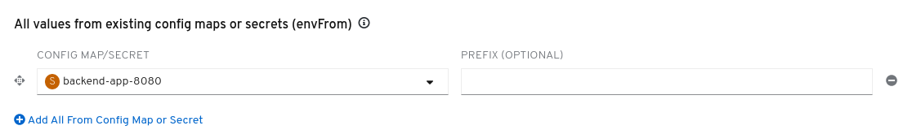
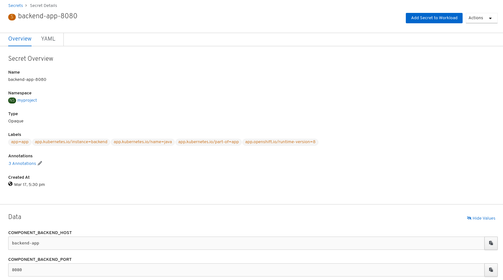


  



## What's ODO

OpenShift Do (`odo`) is a fast, iterative, and straightforward CLI tool for developers who write, build, and deploy applications on OpenShift.

Existing tools such as `oc` are more operations-focused and require a deep-understanding of Kubernetes and OpenShift concepts. `odo` abstracts away complex Kubernetes and OpenShift concepts for the developer, thus allowing developers to focus on what is most important to them: code.

`odo` is designed to be simple and concise with the following key features:

* Simple syntax and design centered around concepts familiar to developers, such as projects, applications, and components.
* Completely client based. No server is required within the OpenShift cluster for deployment.
* Official support for Node.js and Java components.
* Partial compatibility with languages and frameworks such as Ruby, Perl, PHP, and Python.
* Detects changes to local code and deploys it to the cluster automatically, giving instant feedback to validate changes in real time.
* Lists all the available components and services from the {product-title} cluster.

In this LAB we'll deploy an application with ODO and then We will show how to deploy the same application using the OC command so you can compare the workflows.


## About the example application

The application you will be deploying is a wild west shooter style game.

Applications are often divided into components based on a logical division of labor. For example, an application might consist of a data-storage, backend component that performs the application's primary work and stores the results. The backend component is paired with a user interface, frontend component that accesses the backend to retrieve data and displays it to a user.

The application deployed in this tutorial consists of two such components.

**Backend**

The backend is a Java Spring Boot application. It performs queries against the Kubernetes and OpenShift REST APIs to retrieve a list of the resource objects that were created when you deployed the application. Then, it returns details about these resource objects to the frontend.

A deployment using a pre-compiled binary will be used

**Frontend**

The frontend is the user interface for a wild west style game written in Node.js. It displays popup images which you can shoot, corresponding to the resource objects returned by the backend.

A source-to-image (S2I) deployment will be used (but from local dir)

## Creating a new binary component

First, be sure that you are in the `lab-intro-{{ username }}`:

```execute
odo project set lab-intro-{{ username }}
```

As mentioned, applications often consist of two or more components that work together to implement the overall application. OpenShift helps organize these modular applications with a concept called, appropriately enough, the application. An OpenShift application represents all of an app's components in a logical management unit. The `odo` tool helps you manage that group of components and link them together as an application.

A selection of runtimes, frameworks, and other components are available on an OpenShift cluster for building your applications. This list is referred to as the **Developer Catalog**.

List the supported component types in the catalog by running:

```execute
odo catalog list components
```

Administrators can configure the catalog to determine what components are available in the catalog, so the list will vary on different OpenShift clusters. For this scenario, the cluster's catalog list must include `java` and `nodejs`.

Source code for the backend of our `wildwest` application is available in Github:

```execute
cd ~
git clone https://github.com/openshift-evangelists/Wild-West-Backend.git
```

Change directories into the source directory, `Wild-West-Backend`:

```execute
cd ~/Wild-West-Backend
```

Take a look at the contents of the `backend` directory. It's a regular Java Spring Boot application using the Maven build system:

```execute
ls
```

Build the `backend` source files with Maven to create a jar file:

```execute
mvn package
```

Since this is the first time running this build, it may take 30-45 seconds to complete. Subsequent builds will run much more quickly.

With the backend's `.jar` file built, we can use `odo` to deploy and run it atop the Java application server we saw earlier in the catalog. The command below creates a *component* configuration of *component-type* `java` named `backend`:

```execute
odo create java:8 backend --binary target/wildwest-1.0.jar
```

As the component configuration is created, `odo` will print the following:

```
✓  Validating component [6ms]
Please use `odo push` command to create the component with source deployed
```

The component is not yet deployed on OpenShift. With an `odo create` command, a configuration file called `config.yaml` has been created in the local directory of the `backend` component that contains information about the component for deployment.

To see the configuration settings of the `backend` component in `config.yaml`, `odo` has a command to display this information:

```execute
odo config view
```

Since `backend` is a binary component, as specified in the `odo create` command above, changes to the component's source code should be followed by pushing the jar file to a running container. After `mvn` compiled a new `wildwest-1.0.jar` file, the program would be deployed to OpenShift with the `odo push` command. We can execute such a push right now:

```execute
odo push
```

As the push is progressing, `odo` will print output similar to the following:

```
Validation
 ✓  Checking component [13ms]

Configuration changes
 ✓  Initializing component
 ✓  Creating component [107ms]

Pushing to component backend of type binary
 ✓  Checking files for pushing [2ms]
 ✓  Waiting for component to start [59s]
 ✓  Syncing files to the component [14s]
 ✓  Building component [2s]
```

Using `odo push`, OpenShift has created a container to host the `backend` component, deployed the container into a pod running on the OpenShift cluster, and started up the `backend` component.

You can view the `backend` component being started up in the [Web Console]({{ console_url }}) by switching over from the **Administrator** perspective to the **Developer** perspective. To do this, select the **Developer** option from the dropdown menu as shown below:


After selecting the **Developer** option, you will be on the **Topology** view that shows what components are deployed in your OpenShift project. The `backend` component is successfully deployed as a container that runs on a pod. When a dark blue circle appears around the backend component as shown below, the pod is ready and the `backend` component container will start running on it.


If you want to check on the status of an action in `odo`, you can use the `odo log` command. When `odo push` is finished, run `odo log` to follow the progress of the `backend` component deployment:

```execute-2
<ctrl-c>
cd ~/Wild-West-Backend
odo log -f
```

You should see output similar to the following to confirm the `backend` is running on a container in a pod in `myproject`:

```
2019-05-13 12:32:15.986  INFO 729 --- [           main] c.o.wildwest.WildWestApplication         : Started WildWestApplication in 6.337 seconds (JVM running for 7.779)
```

The `backend` jar file has now been pushed, and the `backend` component is running.

## Deploying the Frontend component

With the `backend` component running and connected to persistent storage, we are ready to bring up the `frontend` component and connect it to the `backend`. Once again, source code for the component is already available in GitHub:

```execute
cd ~
git clone https://github.com/openshift-evangelists/Wild-West-Frontend.git
```

Change directories to the `Wild-West-Frontend` directory:

```execute
cd ~/Wild-West-Frontend
```

Listing the contents of this directory shows that `frontend` is a Node.js application.

```execute
ls
```

Since `frontend` is written in an interpreted language, there is no build step analogous to the Maven build we performed for the `backend` component. We can proceed directly to specifying the `nodejs` environment from the cluster's catalog.

We give this Node.js component the name `frontend`:

```execute
odo create nodejs frontend
```

`odo` will create a `config.yaml` just like with the `backend` component, and you should see the following output:

```
✓  Validating component [6ms]
Please use `odo push` command to create the component with source deployed
```

With the component named and the config file created, we can push the Node.js source code from the current directory:

```execute
odo push
```

`odo push` should produce the following output:

```
Validation
 ✓  Checking component [23ms]

Configuration changes
 ✓  Initializing component
 ✓  Creating component [86ms]

Pushing to component frontend of type local
 ✓  Checking files for pushing [710993ns]
 ✓  Waiting for component to start [52s]
 ✓  Syncing files to the component [26s]
 ✓  Building component [8s]
 ✓  Changes successfully pushed to component
```

When we created the `backend` component, we viewed the logs via the terminal. You can also follow the status of your container creation in the [Web Console]({{ console_url }}). Click the **Console** tab and make sure you're in the project named `lab-intro-{{ username }}`.

Depending on how far along your `odo push` is, you may see the pod for the `frontend` component starting up with a light blue ring as shown below. This light blue ring means the pod is in a pending state and hasn't started yet:


Once the pod becomes available, you'll see the `frontend` component become available with a dark blue ring around it like the `backend` component has. This is shown below:


To see the logs of the `frontend` component, wait for the dark blue ring to appear around the component and then click on the `frontend` component circle. This should bring up the deployment config for `frontend` and present the option to **View Logs** under the **Pods** section. This is shown below:


Click on **View Logs** where you should eventually see the following logs confirming `frontend` is running:

```
CONFIG ERROR: Can't find backend webservices component!
Use `odo link` to link your front-end component to a backend component.
Listening on 0.0.0.0, port 8080
Frontend available at URL_PREFIX: /
{ Error: 'Backend Component Not Configured' }
```

Don't worry about the error message for now! You'll correct this in the next section.

When you are done viewing the logs, click on the **Topology** tab on the left side of the [Web Console]({{ console_url }}) to head back to `lab-intro-{{ username }}`.


## Linking Components

With both components of our application running on the cluster, we need to connect them so they can communicate. OpenShift provides mechanisms to publish communication bindings from a program to its clients. This is referred to as linking.

To link the current `frontend` component to the `backend`, you can run:

```execute
odo link backend --component frontend --port 8080
```

This will inject configuration information into the `frontend` about the `backend` and then restart the `frontend` component.

The following output will be displayed to confirm the linking information has been added to the `frontend` component:

```
✓  Component backend has been successfully linked from the component frontend

The below secret environment variables were added to the 'frontend' component:

· COMPONENT_BACKEND_PORT
· COMPONENT_BACKEND_HOST

You can now access the environment variables from within the component pod, for example:
$COMPONENT_BACKEND_HOST is now available as a variable within component frontend
```

If you head back quickly enough to the [Web Console]({{ console_url }}) by clicking on the **Console** tab, you will see the `frontend` component have its dark blue ring turn light blue again. This means that the pod for `frontend` is being restarted so that it will now run with information about how to connect to the `backend` component. When the frontend component has a dark blue ring around it again, the linking is complete.


If you want to know more about how this link has been done, if you check the environment variables in the deployment config of the frontend, you will see how a new environment file backed by a `secret` has been created:





If you review the contents of such secret you will see something like this:




So in fact the `odo link` is creating an environment in the frontend backed by a secret that is pointing to the name of the deploymentconfig of the "backend" component. If you want to double check the names of the components you can run:

```execute
odo list
```

You will see something like this:

```
$ odo list
APP     NAME         TYPE       SOURCE                             STATE
app     backend      java       file://target/wildwest-1.0.jar     Pushed
app     frontend     nodejs     file://./                          Pushed
```

But Why the frontend can reach the backend with this `COMPONENT_BACKEND_HOST` and `COMPONENT_BACKEND_PORT` environment variables? Well this is because the code has been prepared for such thing. So if you want to use ODO and connect the components in such easy way, you need to prepare your code to look for specific environment variables.

You can check the code here:

https://github.com/openshift-evangelists/Wild-West-Frontend/blob/bdbd9e6e57c3f0a0443c54e069d1eafe4b828ae9/bin/config.js

As you can see there is a section to get the variables from the odo components:

```
..
..
  // Autodetect Linked Components
  var backend_component= undefined,
      backend_component_url= undefined,
      backend_component_name= process.env.BACKEND_COMPONENT_NAME,
      backend_path = process.env.BACKEND_PATH || "/ws",
      no_slash_frontend = undefined,
      frontend_path = process.env.URL_PREFIX || "/",
      components = multipaas.components,
      component  = multipaas.component
..
..
```

and then it configures the environment variables needed by the code using the information of that "component"

```
..
..
  // Configure the BACKEND_SERVICE host address via environment variables,
  // OR, use `odo link backend` (where "backend" is the name of your backend component)
  // To select a specific component by name, set the "BACKEND_COMPONENT_NAME" env var:
  var backend_host = process.env.BACKEND_SERVICE || backend_component_url;
  var config = multipaas().add({
    'no_slash_frontend': no_slash_frontend,
    'frontend_path': frontend_path,
    'path_info': "Frontend available at URL_PREFIX: "+frontend_path,
    'components': components,
    'backend_component_name': backend_component_name,
    'backend_path': backend_path,
    'backend_component': backend_component,
    'backend_component_url': backend_component_url,
    'backend_host': backend_host,
    'backend_config_error': { 'Error': "Backend Component Not Configured" },
    'backend_config_info': "Proxying \""+backend_path+"/*\" to '"+backend_host+"'"
  });
..
..
```


Once the linking is complete, you can click on the `frontend` component circle again and select **View Logs**. This time, instead of an error message, you will see the following confirming the `frontend` is properly communicating with the `backend` component:

```
Listening on 0.0.0.0, port 8080
Frontend available at URL_PREFIX: /
Proxying "/ws/*" to 'backend-app:8080'
```

Now that the `frontend` component has been linked with the `backend` component, let's make `frontend` publicly accessible.

## Exposing components

We have updated `frontend` to be linked with `backend` to allow our application's components to communicate. Let's now create an external URL for our application so we can see it in action:

```execute
odo url create frontend --port 8080
```

Once the URL has been created in the `frontend` component's configuration, you will see the following output:

```
✓  URL created for component: frontend

To create URL on the OpenShift cluster, please run `odo push`
```

The change can now be pushed:

```execute
odo push
```

`odo` will print the URL generated for the application. It should be located in the middle of the output from `odo push` similar to the output below:

```
Validation
 ✓  Checking component [34ms]

Configuration changes
 ✓  Retrieving component data [27ms]
 ✓  Applying configuration [25ms]

Applying URL changes
 ✓  URL frontend: http://frontend-app-lab-intro-{{ username }}.{{ cluster_subdomain }} created

Pushing to component frontend of type local
 ✓  Checking file changes for pushing [832029ns]
 ✓  No file changes detected, skipping build. Use the '-f' flag to force the build.
```

Visit the URL in your browser to view the application once the `odo push` command finishes:

http://frontend-app-lab-intro-{{ username }}.{{ cluster_subdomain }}

## Making changes to source code

We've deployed the first version of our application and tested it by visiting it with a browser. Let's look at how OpenShift and `odo` help make it easier to iterate on that app once it's running.

First, make sure you are still in the `frontend` directory:

```execute
cd ~/Wild-West-Frontend
```

Now, we will tell `odo` to `watch` for changes on the file system in the background. Note that the `&` is included to run `odo watch` in the background for this tutorial, but it is usually just run as `odo watch` and can be terminated using `ctrl+c`.

```execute-2
<ctrl-c>
cd ~/Wild-West-Frontend
odo watch
```

Let's change the displayed name for our wild west game. Currently, the title is "Wild West The OpenShift Way!" We will change this to "My App The OpenShift Way!"


Edit the file `index.html` with a search-and-replace one-liner performed with the Unix stream editor, `sed`:

```execute
sed -i "s/Wild West/My App/" index.html
```

There may be a slight delay before `odo` recognizes the change. Once the change is recognized, `odo` will push the changes to the `frontend` component and print its status to the terminal:

```
File /root/frontend/index.html changed
File  changed
Pushing files...
✓  Waiting for component to start [10ms]
✓  Syncing files to the component [16s]
✓  Building component [6s]
```

Refresh the application's page in the web browser. You will see the new name in the web interface for the application.

__NOTE__: If you no longer have the application page opened in a browser, you can recall the url by executing:

```execute
odo url list
```


## Deploying the application with oc client

In order to compare between the workflow of deploying a multi-tier application with ODO and OC, now we'll re-deploy the same app but without ODO.

First, let's start from scratch, so remove every object in the project:

```execute
oc delete all --all
```


### Deploying the Backend with oc client

First steps until the backend build with Maven are the same, since we need to create the binary (this will be a binary deployment), so let's be sure that we are in the right path ( `/opt/app-root/src/Wild-West-Backend` ) and we have the `target/wildwest-1.0.jar` file

```execute
cd ~/Wild-West-Backend
ls target/wildwest-1.0.jar
```

Then We have to choose the right ImageStream (container image), we don't have the `odo catalog list components` command but We can do:

```execute
oc get is -n openshift | grep java
```

Output:

```
$ oc get is -n openshift | grep java
fis-java-openshift                             image-registry.openshift-image-registry.svc:5000/openshift/fis-java-openshift                             1.0,2.0                                               22 hours ago
fuse7-java-openshift                           image-registry.openshift-image-registry.svc:5000/openshift/fuse7-java-openshift                           1.0,1.1,1.2,1.3,1.4                                   22 hours ago
java                                           image-registry.openshift-image-registry.svc:5000/openshift/java                                     11,8,latest                                           22 hours ago
jboss-fuse70-java-openshift                    image-registry.openshift-image-registry.svc:5000/openshift/jboss-fuse70-java-openshift                    1.0
```

As we did using ODO We will be using java:8, let's create a binary build using this image:


```execute
oc new-build --image-stream=java:8 --binary=true  --name=wildwest-backend
```

Output example:


```
$ oc new-build --image-stream=java:8 --binary=true --name=wildwest-backend
--> Found image fc8de88 (7 weeks old) in image stream "openshift/java" under tag "8" for "java:8"

    Java Applications
    -----------------
    Platform for building and running plain Java applications (fat-jar and flat classpath)

    Tags: builder, java

    * A source build using binary input will be created
      * The resulting image will be pushed to image stream tag "wildwest-backend:latest"
      * A binary build was created, use 'oc start-build --from-dir' to trigger a new build

--> Creating resources with label build=wildwest-backend ...
    imagestream.image.openshift.io "wildwest-backend" created
    buildconfig.build.openshift.io "wildwest-backend" created
--> Success
```

The buildconfig have been created at this point:


```execute
oc get bc
```

Output:

```
$ oc get bc
NAME               TYPE     FROM     LATEST
wildwest-backend   Source   Binary   0
```


At this moment, remember that with binary deployments we have to first create the build, and then launch that build, so let's do the latter using the local dir:

```execute
oc start-build  wildwest-backend --from-dir=.
```

Output example:

```
$ oc start-build  wildwest-backend --from-dir=.
Uploading directory "." as binary input for the build ...
...
Uploading finished
build.build.openshift.io/wildwest-backend-1 started
```

As we did with ODO, We can check the logs:

check the logs:

```execute-2
<ctrl-c>
oc logs build/wildwest-backend-1 -f
```

When finished, We will have a new ImageStream for the backend:

```execute
oc get is
```

Output:

```
$ oc get is
NAME               IMAGE REPOSITORY                                                                     TAGS     UPD
ATED
java               image-registry.openshift-image-registry.svc:5000/lab-intro-user18/java
wildwest-backend   image-registry.openshift-image-registry.svc:5000/lab-intro-user18/wildwest-backend   latest   2 m
inutes ago
```

Finally ,after creating and running the build, you need to launch the deployment of that new ImageStream:

```execute
oc new-app wildwest-backend
```

Output example:

```
$ oc new-app wildwest-backend
--> Found image a7012cb (2 minutes old) in image stream "lab-intro-user18/wildwest-backend" under tag "latest" for "
wildwest-backend"

    Java Applications
    -----------------
    Platform for building and running plain Java applications (fat-jar and flat classpath)

    Tags: builder, java

    * This image will be deployed in deployment config "wildwest-backend"
    * Ports 8080/tcp, 8443/tcp, 8778/tcp will be load balanced by service "wildwest-backend"
      * Other containers can access this service through the hostname "wildwest-backend"

--> Creating resources ...
    deploymentconfig.apps.openshift.io "wildwest-backend" created
    service "wildwest-backend" created
--> Success
    Application is not exposed. You can expose services to the outside world by executing one or more of the command
s below:
     'oc expose svc/wildwest-backend'
    Run 'oc status' to view your app.
```

The PODs are created:

```execute
oc get pod
```

Output example:

```
$ oc get pod
NAME                        READY   STATUS      RESTARTS   AGE
wildwest-backend-1-build    0/1     Completed   0          5m2s
wildwest-backend-1-deploy   0/1     Completed   0          48s
wildwest-backend-1-m5c9n    1/1     Running     0          39s
```

You can also check the logs when the POD is running with this command:

```execute-2
<ctrl-c>
oc logs pod/$(oc get pod | grep Running | awk '{print $1}') -f
```


### Deploying the Frontend with oc client

The frontend is deployed using a source-to-image deployment, but in this case, to do it in the same way that We did with ODO, We'll use the code in the local dir.

First go to the right PATH:

```execute
cd ~/Wild-West-Frontend
```

Then run a source-to-image deployment using nodejs as base and indicating the loca dir (.) instead an external repository:


```execute
oc new-app nodejs~.
```

Output example:

```
$ oc new-app nodejs~.
--> Found image 51965b7 (3 weeks old) in image stream "openshift/nodejs" under tag "10-SCL" for "nodejs"

    Node.js 10
    ----------
    Node.js 10 available as container is a base platform for building and running various Node.js 10 applications and frameworks. Node.js is a platform
 built on Chrome's JavaScript runtime for easily building fast, scalable network applications. Node.js uses an event-driven, non-blocking I/O model tha
t makes it lightweight and efficient, perfect for data-intensive real-time applications that run across distributed devices.

    Tags: builder, nodejs, nodejs10

    * A source build using source code from https://github.com/openshift-evangelists/Wild-West-Frontend.git#master will be created
      * The resulting image will be pushed to image stream tag "wild-west-frontend:latest"
      * Use 'oc start-build' to trigger a new build
    * This image will be deployed in deployment config "wild-west-frontend"
    * Port 8080/tcp will be load balanced by service "wild-west-frontend"
      * Other containers can access this service through the hostname "wild-west-frontend"

--> Creating resources ...
    imagestream.image.openshift.io "wild-west-frontend" created
    buildconfig.build.openshift.io "wild-west-frontend" created
    deploymentconfig.apps.openshift.io "wild-west-frontend" created
    service "wild-west-frontend" created
--> Success
    Build scheduled, use 'oc logs -f bc/wild-west-frontend' to track its progress.
    Application is not exposed. You can expose services to the outside world by executing one or more of the commands below:
     'oc expose svc/wild-west-frontend'
    Run 'oc status' to view your app.
```

Again, you can check the logs of this build:


```execute-2
<ctrl-c>
oc logs build/wild-west-frontend-1 -f
```

When the build finish, a deployment will be triggered and then you will find the new PODs:


```execute
oc get pod
```

Output example:

```
 $ oc get pod
NAME                          READY   STATUS      RESTARTS   AGE
wild-west-frontend-1-build    0/1     Completed   0          2m6s
wild-west-frontend-1-deploy   0/1     Completed   0          59s
wild-west-frontend-1-ldl95    1/1     Running     0          51s
wildwest-backend-1-build      0/1     Completed   0          25m
wildwest-backend-1-deploy     0/1     Completed   0          21m
wildwest-backend-1-m5c9n      1/1     Running     0          21m
```

We face the same "issue" that when We deployed using ODO because the Frontend does not know how to reach the backend component:

```execute-2
<ctrl-c>
oc logs pod/$(oc get pod | grep Running | grep front | awk '{print $1}') -f
```


You will see this error in the logs:


```
CONFIG ERROR: Can't find backend webservices component!
Use `odo link` to link your front-end component to a backend component.
Listening on 0.0.0.0, port 8080
Frontend available at URL_PREFIX: /
{ Error: 'Backend Component Not Configured' }
```


### Linking Frontend and Backend

So now let's link the Frontend and the Backend. We used the `odo link` command before. That command configured some pre-defined environment variables (`COMPONENT_BACKEND_HOST` and `COMPONENT_BACKEND_PORT`) that made the frontend code get the value of the backend URL.

Knowing how the code works is important, not only in this example, but in any deployment, since you will need to know how to let your code know about the other components of your application. That is used to be done using secrets, configmaps or just environment variables. For example in the specific case of this code, after checking the code of the frontend service (https://github.com/openshift-evangelists/Wild-West-Frontend), you can see how we could also pass a single environment file called `BACKEND_SERVICE` since the `COMPONENT_BACKEND_HOST` and `COMPONENT_BACKEND_PORT` variables just create the former one.

In case of this code it's not easy to spot since it's using config-multipass (https://github.com/ryanj/config-multipaas) but it's easy understandable if we take a look to a previous commit of the `config.js` file where this is configured:

https://github.com/openshift-evangelists/Wild-West-Frontend/commit/e2e16d555ec6c448720b6c1a1a2c2ff739818d96


In this code it is more easy to see how the a `backend_component_url` variable is created from `COMPONENT_BACKEND_HOST` and `COMPONENT_BACKEND_PORT` and the the final variable `backend_host` gets the value either from this `backend_component_url` variable of from the `BACKEND_SERVICE` environment variable:


```
..
..
// Autodetect Linked Components
var findComponents = function(env){
  if(!env){
    env = process.env;
  }
  var component_list = []
  var name = '';
  for( var key in env ){
    name = key.replace('COMPONENT_','').replace('_HOST','')
    if(key.indexOf('COMPONENT_'+name+'_HOST') == 0 && env['COMPONENT_'+name+'_PORT']){
      component_list.push(name);
    }
  }
  return component_list;
}
..
..
    backend_component_url = process.env['COMPONENT_'+backend_component+'_HOST'] + ':' + process.env['COMPONENT_'+backend_component+'_PORT']
..
..
  var backend_host = process.env.BACKEND_SERVICE || backend_component_url;
..
..
```

In this case , Will can also know this just without having to take a look to the code since it's explained in the README file:


```
Configuration of Backend Service host url via Env Var:

export BACKEND_SERVICE="my-backend-host-url.com"
```

So We need to setup either just the `BACKEND_SERVICE` variable or the `COMPONENT_BACKEND_HOST` and `COMPONENT_BACKEND_PORT` variables in the deploymentconfig.

This time let's do it in the same way that We did with ODO and We will configure the `COMPONENT_BACKEND_HOST` and `COMPONENT_BACKEND_PORT` variables.. but, What value? Well, as we don't want to expose the backend service outside OpenShift We'll use the internal name for it, that is the name of the service:


```execute
oc get service
```

In the output you will see how the service name for the backend is `wildwest-backend`

```
$ oc get service
NAME                 TYPE        CLUSTER-IP       EXTERNAL-IP   PORT(S)                      AGE
wild-west-frontend   ClusterIP   172.30.132.229   <none>        8080/TCP                     59m
wildwest-backend     ClusterIP   172.30.149.149   <none>        8080/TCP,8443/TCP,8778/TCP   78m
```

We can get just the name `wildwest-backend ` or the IP `172.30.149.149` (both work internally) for the host and `8080` as the port. You can also get the value directly using this commands:

```execute
COMPONENT_BACKEND_HOST=$(oc get svc wildwest-backend --template={{.spec.clusterIP}})
```

```execute
COMPONENT_BACKEND_PORT=$(oc get svc wildwest-backend  -o=jsonpath='{ .spec.ports[?(@.name == "8080-tcp")].targetPort }')
```

The `BACKEND_SERVICE`, in case that you decide to use it instead of `COMPONENT_BACKEND_HOST` and `COMPONENT_BACKEND_PORT`, would be then `wildwest-backend:8080`

So let's include that new environment file in the deploymentconfig:

```execute
oc set env dc/wild-west-frontend COMPONENT_BACKEND_HOST=${COMPONENT_BACKEND_HOST} COMPONENT_BACKEND_PORT=${COMPONENT_BACKEND_PORT}
```

New PODs will be created:

```execute
oc get pod
```


Output example:

```
$ oc get pod
NAME                          READY   STATUS              RESTARTS   AGE
wild-west-frontend-1-build    0/1     Completed           0          41m
wild-west-frontend-1-deploy   0/1     Completed           0          40m
wild-west-frontend-1-ldl95    1/1     Running             0          40m
wild-west-frontend-2-deploy   0/1     ContainerCreating   0          4s
wildwest-backend-1-build      0/1     Completed           0          65m
wildwest-backend-1-deploy     0/1     Completed           0          61m
wildwest-backend-1-m5c9n      1/1     Running             0          60m
```

You can check the logs when the new POD is running in order to check that the error has disappear:

```execute-2
<ctrl-c>
oc logs pod/$(oc get pod | grep Running | grep front | awk '{print $1}') -f
```


### Exposing the Frontend and testing the application

Last step is to create a new route in order to make the frontend accessible from outside:

```execute
oc expose service wild-west-frontend
```

Check the route created:

```execute
oc get route
```

And check that the application is working:

http://wild-west-frontend-lab-intro-{{ username }}.{{ cluster_subdomain }}


## Clean the environment

Delete all objects to start the next section with a clean project

```execute
oc delete all --all
```
