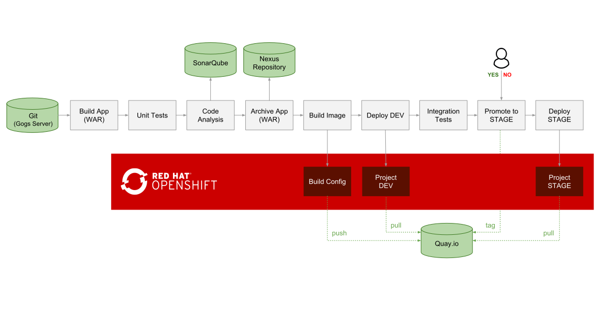
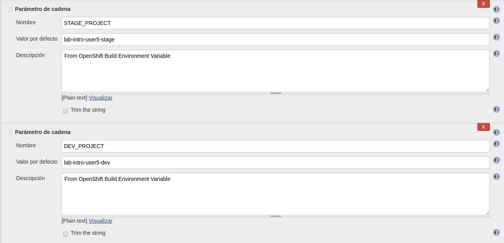
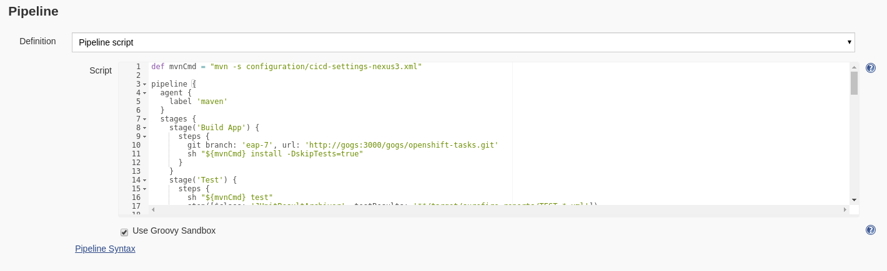
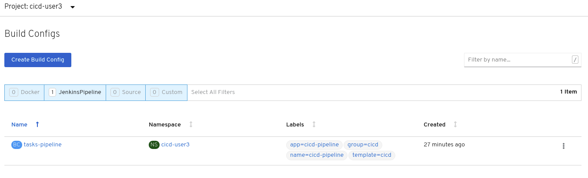
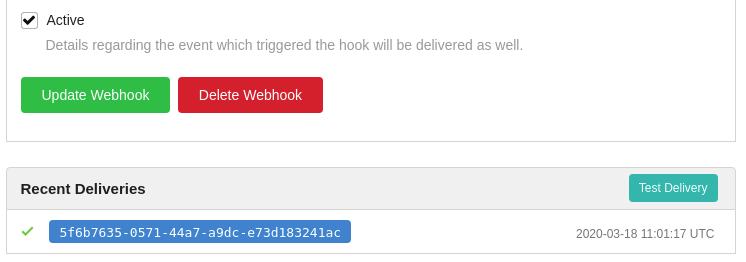
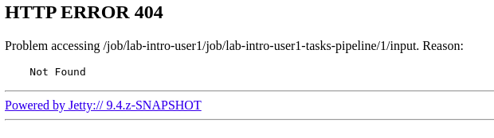
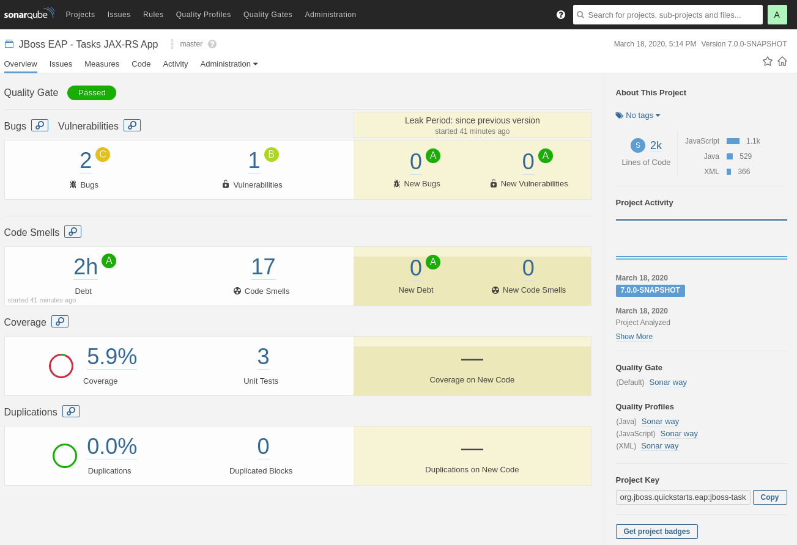

We will use an example from the repo cloned below that puts all together. Understanding this lab is a good review of all concepts that We have been practising in the previous workshop modules and We will also see new ones while deploying the lab.

Once finished, it creates a pipeline and on every pipeline execution, the code goes through the following steps:

. Code is cloned from Gogs, built, tested and analyzed for bugs and bad patterns
The WAR artifact is pushed to Nexus Repository manager

. A container image (tasks:latest) is built based on the Tasks application WAR artifact deployed on WildFly

. The Tasks container image is deployed in a fresh new container in DEV project (pulled form Quay.io, if enabled)

. If tests successful, the pipeline is paused for the release manager to approve the release to STAGE

. If approved, the DEV image is tagged in the STAGE project. If Quay.io is enabled, the image is tagged in the Quay.io image repository using Skopeo

. The staged image is deployed in a fresh new container in the STAGE project (pulled form Quay.io, if enabled)

So let's clone this lab:

[source,bash,role="execute"]
----
cd ~
git clone -b ocp-4.2 https://github.com/jimgarrett123/openshift-cd-demo.git
cd openshift-cd-demo
----

## Deploy CI/CD components

### OpenShift Projects

Since We want that our lab can promote between multiple environments (DEV and Stage), We will create a couple of new projects:

[source,bash,role="execute"]
----
oc new-project lab-intro-{{ username }}-dev --display-name="Tasks - Dev"
oc new-project lab-intro-{{ username }}-stage --display-name="Tasks - Stage"
----

Everytime that you create a new project, the CLI change to that project, so switch back to the original one:

[source,bash,role="execute"]
----
oc project lab-intro-{{ username }}
----

Jenkins will need to have access to these new projects, so let's give access to them to a serviceaccount that will be used:

[source,bash,role="execute"]
----
oc policy add-role-to-group edit system:serviceaccounts:lab-intro-{{ username }} -n lab-intro-{{ username }}-dev
oc policy add-role-to-group edit system:serviceaccounts:lab-intro-{{ username }} -n lab-intro-{{ username }}-stage
----

### Deploy Jenkins application

Let's deploy the template with the Jenkins using ephemeral storage (remember that you can search for Jenkins templates with `oc new-app --search jenkins`)

[source,bash,role="execute"]
----
oc new-app jenkins-ephemeral -n lab-intro-{{ username }}
----

### Deploy an OpenShift Template for the rest of the components

We will deploy all components using a template. Let's review what objects will be created

[source,bash,role="execute-2"]
----
<ctrl-c>
less cicd-template.yaml
----

#### Template: RoleBinding

The first thing that we can find is a rolebinding. If you remember, we said that some applications would need to access the OpenShift API. In those cases we would need to add a role to the default ServiceAccount. In the example that We gave We attached the `view` role, but in this case, since the application need to make some changes in the configuration via OpenShift API, We need to give it the `admin` role:

----
..
..
- apiVersion: v1
  groupNames: null
  kind: RoleBinding
  metadata:
    name: default_admin
  roleRef:
    name: admin
  subjects:
  - kind: ServiceAccount
    name: default
..
..
----

#### Template: BuildConfig

The next thing to be created is a buildconfig called 'tasks-pipeline' with the Jenkins pipeline definition script. This workshop is not showing how to create these scripts using the link:https://jenkins.io/doc/book/pipeline/syntax[Pipeline domain-specific language (DSL)] but as you can see they are easy to understand, for example, this one have configured multiple stages:

. Stage 'Build App': It uses the eap-7 branch of the repository that will be hosted in GOGS (https://github.com/rgupta1234/openshift-tasks) and run a mvn install, so it frames a dependency tree based on the project configuration pom.xml and download the dependencies. As you can see, We know in advance the URL of the GOGS repository since We are configuring the service name instead of an IP, and the service name is configurable when you create it.

. Stage 'Test': It performs the Unit test by running the mvn tests

. Stage 'Code Analysis': It uses maven to send the code to Sonarqube to inspect the code quality and perform automatic reviews with static analysis of code to detect bugs, code smells, and security vulnerabilities. As with the GOGS access, we use here the internal service name for sonarqube

. Stage 'Archive App': It uses maven to deploy the artifacts into Nexus. Here we are not including the URL for nexus, that is because it is already configured in the pom.xml file that will be hosted in GOGS (you can see a copy here: https://github.com/rgupta1234/openshift-tasks/blob/master/pom.xml)

. Stage 'Build Image': We use a builconfig called `tasks` that will be contained in the lab-intro-{{ username }}-dev project. We will review how is that buldconfig configured  but as you guess it will be using a binary build since we are passing the WAR file.

. Stage 'Deploy DEV': We deploy in lab-intro-{{ username }}-dev project the application with the container image created by the build done in the previous stage.

. Stage 'Promote to STAGE?': Here the pipeline just wait that someone (real person) checks the application in the lab-intro-{{ username }}-dev project and accept it to be promoted into STAGE. When accepted, it will copy the image to Quay if it is used (link:https://www.openshift.com/products/quay[Quay is a Enterprise Registry provided by Red Hat]) or just, in case Quay is not there, since We share the registry between DEV and STAGE, it just tag the imagestream with `stage` tag. `oc tag` command allows you to update an OpenShift Container Platform image stream with a reference to a specific image. It also allows you to copy references to specific versions of an image from one image stream to another, even across different projects in a cluster.

. Stage 'Deploy STAGE': It uses the deploymentconfig on the STAGE project (lab-intro-{{ username }}-stage) to deploy the application using the promoted image in the previous step.

----
..
..
- apiVersion: v1
  kind: BuildConfig
  metadata:
    annotations:
      pipeline.alpha.openshift.io/uses: '[{"name": "jenkins", "namespace": "", "kind": "DeploymentConfig"}]'
    labels:
      app: cicd-pipeline
      name: cicd-pipeline
    name: tasks-pipeline
  spec:
    triggers:
      - type: GitHub
        github:
          secret: ${WEBHOOK_SECRET}
      - type: Generic
        generic:
          secret: ${WEBHOOK_SECRET}
    runPolicy: Serial
    source:
      type: None
    strategy:
      jenkinsPipelineStrategy:
        env:
        - name: DEV_PROJECT
          value: ${DEV_PROJECT}
        - name: STAGE_PROJECT
          value: ${STAGE_PROJECT}
        - name: ENABLE_QUAY
          value: ${ENABLE_QUAY}
        jenkinsfile: |-
          def mvnCmd = "mvn -s configuration/cicd-settings-nexus3.xml"
          pipeline {
            agent {
              label 'maven'
            }
            stages {
              stage('Build App') {
                steps {
                  git branch: 'eap-7', url: 'http://gogs:3000/gogs/openshift-tasks.git'
                  sh "${mvnCmd} install -DskipTests=true"
                }
              }
              stage('Test') {
                steps {
                  sh "${mvnCmd} test"
                  step([$class: 'JUnitResultArchiver', testResults: '**/target/surefire-reports/TEST-*.xml'])
                }
              }
              stage('Code Analysis') {
                steps {
                  script {
                    sh "${mvnCmd} sonar:sonar -Dsonar.host.url=http://sonarqube:9000 -DskipTests=true"
                  }
                }
              }
              stage('Archive App') {
                steps {
                  sh "${mvnCmd} deploy -DskipTests=true -P nexus3"
                }
              }
              stage('Build Image') {
                steps {
                  sh "cp target/openshift-tasks.war target/ROOT.war"
                  script {
                    openshift.withCluster() {
                      openshift.withProject(env.DEV_PROJECT) {
                        openshift.selector("bc", "tasks").startBuild("--from-file=target/ROOT.war", "--wait=true")
                      }
                    }
                  }
                }
              }
              stage('Deploy DEV') {
                steps {
                  script {
                    openshift.withCluster() {
                      openshift.withProject(env.DEV_PROJECT) {
                        openshift.selector("dc", "tasks").rollout().latest();
                      }
                    }
                  }
                }
              }
              stage('Promote to STAGE?') {
                agent {
                  label 'skopeo'
                }
                steps {
                  timeout(time:15, unit:'MINUTES') {
                      input message: "Promote to STAGE?", ok: "Promote"
                  }
                  script {
                    openshift.withCluster() {
                      if (env.ENABLE_QUAY.toBoolean()) {
                        withCredentials([usernamePassword(credentialsId: "${openshift.project()}-quay-cicd-secret", usernameVariable: "QUAY_USER", passwordVariable: "QUAY_PWD")]) {
                          sh "skopeo copy docker://quay.io/${QUAY_USERNAME}/${QUAY_REPOSITORY}:latest docker://quay.io/${QUAY_USERNAME}/${QUAY_REPOSITORY}:stage --src-creds \"$QUAY_USER:$QUAY_PWD\" --dest-creds \"$QUAY_USER:$QUAY_PWD\" --src-tls-verify=false --dest-tls-verify=false"
                        }
                      } else {
                        openshift.tag("${env.DEV_PROJECT}/tasks:latest", "${env.STAGE_PROJECT}/tasks:stage")
                      }
                    }
                  }
                }
              }
              stage('Deploy STAGE') {
                steps {
                  script {
                    openshift.withCluster() {
                      openshift.withProject(env.STAGE_PROJECT) {
                        openshift.selector("dc", "tasks").rollout().latest();
                      }
                    }
                  }
                }
              }
            }
          }
      type: JenkinsPipeline
..
..
----

#### Template: ConfigMap

The template will also configure a ConfigMap. If you remember, a configmap provides mechanisms to inject containers with configuration data while keeping containers agnostic of OpenShift Container Platform. In this case, the configmap will inject the Jenkins Agent configuration. 

This is a configuration that can be made using the Jenkins UI as We did in this workshop in aa previous module, but it can be also configured using files, thus we can use configmap to inject those configuration files.

----
..
..
- apiVersion: v1
  kind: ConfigMap
  metadata:
    labels:
      app: cicd-pipeline
      role: jenkins-slave
    name: jenkins-slaves
  data:
    maven-template: |-
      <org.csanchez.jenkins.plugins.kubernetes.PodTemplate>
        <inheritFrom></inheritFrom>
        <name>maven</name>
        <privileged>false</privileged>
        <alwaysPullImage>false</alwaysPullImage>
        <instanceCap>2147483647</instanceCap>
        <idleMinutes>0</idleMinutes>
        <label>maven</label>
        <serviceAccount>jenkins</serviceAccount>
        <nodeSelector></nodeSelector>
        <customWorkspaceVolumeEnabled>false</customWorkspaceVolumeEnabled>
        <workspaceVolume class="org.csanchez.jenkins.plugins.kubernetes.volumes.workspace.EmptyDirWorkspaceVolume">
          <memory>false</memory>
        </workspaceVolume>
        <volumes />
        <containers>
          <org.csanchez.jenkins.plugins.kubernetes.ContainerTemplate>
            <name>jnlp</name>
            <image>openshift/jenkins-agent-maven-35-centos7</image>
            <privileged>false</privileged>
            <alwaysPullImage>false</alwaysPullImage>
            <workingDir>/tmp</workingDir>
            <command></command>
            <args>${computer.jnlpmac} ${computer.name}</args>
            <ttyEnabled>false</ttyEnabled>
            <resourceRequestCpu>200m</resourceRequestCpu>
            <resourceRequestMemory>512Mi</resourceRequestMemory>
            <resourceLimitCpu>2</resourceLimitCpu>
            <resourceLimitMemory>4Gi</resourceLimitMemory>
            <envVars/>
          </org.csanchez.jenkins.plugins.kubernetes.ContainerTemplate>
        </containers>
        <envVars/>
        <annotations/>
        <imagePullSecrets/>
      </org.csanchez.jenkins.plugins.kubernetes.PodTemplate>
    skopeo-template: |-
      <org.csanchez.jenkins.plugins.kubernetes.PodTemplate>
        <inheritFrom></inheritFrom>
        <name>skopeo</name>
        <privileged>false</privileged>
        <alwaysPullImage>false</alwaysPullImage>
        <instanceCap>2147483647</instanceCap>
        <idleMinutes>0</idleMinutes>
        <label>skopeo</label>
        <serviceAccount>jenkins</serviceAccount>
        <nodeSelector></nodeSelector>
        <customWorkspaceVolumeEnabled>false</customWorkspaceVolumeEnabled>
        <workspaceVolume class="org.csanchez.jenkins.plugins.kubernetes.volumes.workspace.EmptyDirWorkspaceVolume">
          <memory>false</memory>
        </workspaceVolume>
        <volumes />
        <containers>
          <org.csanchez.jenkins.plugins.kubernetes.ContainerTemplate>
            <name>jnlp</name>
            <image>docker.io/siamaksade/jenkins-slave-skopeo-centos7</image>
            <privileged>false</privileged>
            <alwaysPullImage>false</alwaysPullImage>
            <workingDir>/tmp</workingDir>
            <command></command>
            <args>${computer.jnlpmac} ${computer.name}</args>
            <ttyEnabled>false</ttyEnabled>
            <envVars/>
          </org.csanchez.jenkins.plugins.kubernetes.ContainerTemplate>
        </containers>
        <envVars/>
        <annotations/>
        <imagePullSecrets/>
      </org.csanchez.jenkins.plugins.kubernetes.PodTemplate>
..
..
----

#### Template: Job

The template will also create an OpenShift Job. We did not talk about Jobs before. A job executes a task in your OpenShift Container Platform cluster. Jobs and CronJobs track the overall progress of a task and updates its status with information about active, succeeded, and failed pods. Deleting a Job will clean up any pods it created. Jobs are part of the Kubernetes API, which can be managed with oc commands like other object types.

A job will create one or more pods and run them to completion. This is different from a replicationController, which keeps the pods up and running. A job will run the pod until the pod finishes the task it was assigned. You can think of a job as a pod with a restartPolicy of Never.

A few use cases for using a job:

* Batch Process That need to run at regular intervals
* Distributed processing of very large data sets
* Long running process for system maintanace

Let's run an example of a Job, first We have to create the Job definition

[source,bash,role="execute-2"]
----
cat >pijob.yaml<<EOF
apiVersion: batch/v1
kind: Job
metadata:
  name: pi
spec:
  parallelism: 1    
  completions: 1    
  template:         
    metadata:
      name: pi
      labels:
        app: pi
    spec:
      containers:
      - name: pi
        image: perl
        command: ["perl",  "-Mbignum=bpi", "-wle", "print bpi(2000)"]
      restartPolicy: Never
EOF
----

Then create the Job

[source,bash,role="execute-2"]
----
oc create -f pijob.yaml 
----

Review the already created Job:

[source,bash,role="execute-2"]
----
oc get jobs
----

In the output you can see how there is one remainting Job that has not been completed

----
$ oc get jobs
NAME                  COMPLETIONS   DURATION   AGE
pi                    0/1           2s         2s
----

If you quickly take a look to the pods you can see how there is POD 'pi' Running or Creating

[source,bash,role="execute-2"]
----
oc get pods
----

Output example:

----
 $ oc get pod
NAME                        READY   STATUS              RESTARTS   AGE
pi-2cbsd                    0/1     ContainerCreating   0          18s
----

After some time, try again to take a look to that POD

[source,bash,role="execute-2"]
----
oc get pods
----

You will see that it has the status of `Completed`, so it's not running anymore. That makes sense, since this application just calculate PI, it is not a long running process listening connections or something like that.

----
$ oc get pod
NAME                        READY   STATUS      RESTARTS   AGE
pi-2cbsd                    0/1     Completed   0          85s
----

We can check how the Job finished

[source,bash,role="execute-2"]
----
oc get jobs
----

Output example

----
$ oc get job
NAME                  COMPLETIONS   DURATION   AGE
pi                    1/1           45s        2m5s
----

You can also take a look to the calculated value in the POD logs

[source,bash,role="execute-2"]
----
oc logs $(oc get pod | grep pi | awk '{print $1}')
----

Let's remove this job now

[source,bash,role="execute-2"]
----
oc delete job pi
----

Now that We understand What a Job is, we can continue with the review of the Job that the template will create.

The person who created this template, decided to create some OpenShift objects and to make some configuration on the OpenShift cluster though a shell script contained in an OpenShift Job, so this job (`cicd-demo-installer`) just run a POD (using the `origin-cli` image that has the oc client already installed) that runs commands against the OpenShift API, creating other sort of objects and configurations that We will review below.

----
..
..
- apiVersion: batch/v1
  kind: Job
  metadata:
    name: cicd-demo-installer
  spec:
    activeDeadlineSeconds: 400
    completions: 1
    parallelism: 1
    template:
      spec:
        containers:
        - env:
          - name: CICD_NAMESPACE
            valueFrom:
              fieldRef:
                fieldPath: metadata.namespace
          command:
          - /bin/bash
          - -x
          - -c
..
..
          image: quay.io/openshift/origin-cli:v4.0
          name: cicd-demo-installer-job
          resources: {}
          terminationMessagePath: /dev/termination-log
          terminationMessagePolicy: File
        restartPolicy: Never
..
..
----

Let's start reviewing the commands launched inside the POD running the Job.

.1 Configure the CPU and memory limits for Jenkins 

----
..
..
            # adjust jenkins 
            oc set resources dc/jenkins --limits=cpu=2,memory=2Gi --requests=cpu=100m,memory=512Mi 
            oc label dc jenkins app=jenkins --overwrite 
..
..
----

.2 Create a new ImageStream (import from external registry) that will be used as base for the builds

----
..
.. 
            # setup dev env
            oc import-image wildfly --from=openshift/wildfly-120-centos7 --confirm -n ${DEV_PROJECT} 
            
..
..
----

.3 Configure Quay
    We skip this snippet

.4 Create a new buildconfig `task` that will use the new ImageStream and will use the binary deployment

----
..
..
            else
              # dev
              oc new-build --name=tasks --image-stream=wildfly:latest --binary=true -n ${DEV_PROJECT}..
..
----

.5 Run the build and deploy the application in both DEV and STAGE projects

----
..
..
              oc new-app tasks:latest --allow-missing-images -n ${DEV_PROJECT}
              oc set triggers dc -l app=tasks --containers=tasks --from-image=tasks:latest --manual -n ${DEV_PROJECT}
              
              # stage
              oc new-app tasks:stage --allow-missing-images -n ${STAGE_PROJECT}
              oc set triggers dc -l app=tasks --containers=tasks --from-image=tasks:stage --manual -n ${STAGE_PROJECT}
            fi
..
..
----

.6 Create the routes and the healthchecks for the already deployed applications based in the `task` build in both DEV and STAGE projects

----
..
..
            
            # dev project
            oc expose dc/tasks --port=8080 -n ${DEV_PROJECT}
            oc expose svc/tasks -n ${DEV_PROJECT}
            oc set probe dc/tasks --readiness --get-url=http://:8080/ws/demo/healthcheck --initial-delay-seconds=30 --failure-threshold=10 --period-seconds=10 -n ${DEV_PROJECT}
            oc set probe dc/tasks --liveness  --get-url=http://:8080/ws/demo/healthcheck --initial-delay-seconds=180 --failure-threshold=10 --period-seconds=10 -n ${DEV_PROJECT}
            oc rollout cancel dc/tasks -n ${STAGE_PROJECT}

            # stage project
            oc expose dc/tasks --port=8080 -n ${STAGE_PROJECT}
            oc expose svc/tasks -n ${STAGE_PROJECT}
            oc set probe dc/tasks --readiness --get-url=http://:8080/ws/demo/healthcheck --initial-delay-seconds=30 --failure-threshold=10 --period-seconds=10 -n ${STAGE_PROJECT}
            oc set probe dc/tasks --liveness  --get-url=http://:8080/ws/demo/healthcheck --initial-delay-seconds=180 --failure-threshold=10 --period-seconds=10 -n ${STAGE_PROJECT}
            oc rollout cancel dc/tasks -n ${DEV_PROJECT}
..
..
----

.7 Deploy GOGS using an external template

----
..
..
            # deploy gogs
            HOSTNAME=$(oc get route jenkins -o template --template='{{.spec.host}}' | sed "s/jenkins-${CICD_NAMESPACE}.//g")
            GOGS_HOSTNAME="gogs-$CICD_NAMESPACE.$HOSTNAME"
            if [ "${EPHEMERAL}" == "true" ] ; then
              oc new-app -f https://raw.githubusercontent.com/siamaksade/gogs/master/gogs-template.yaml \
                  --param=GOGS_VERSION=0.11.34 \
                  --param=DATABASE_VERSION=9.6 \
                  --param=HOSTNAME=$GOGS_HOSTNAME \
                  --param=SKIP_TLS_VERIFY=true
            else
              oc new-app -f https://raw.githubusercontent.com/siamaksade/gogs/master/gogs-template.yaml \
                  --param=GOGS_VERSION=0.11.34 \
                  --param=DATABASE_VERSION=9.6 \
                  --param=HOSTNAME=$GOGS_HOSTNAME \
                  --param=SKIP_TLS_VERIFY=true
            fi
..
..
----

.8 Deploy Sonarqube using an external template

----
..
..
            
            sleep 5
            if [ "${EPHEMERAL}" == "true" ] ; then
              oc new-app -f https://raw.githubusercontent.com/siamaksade/sonarqube/master/sonarqube-template.yml --param=SONARQUBE_MEMORY_LIMIT=2Gi
            else
              oc new-app -f https://raw.githubusercontent.com/siamaksade/sonarqube/master/sonarqube-persistent-template.yml --param=SONARQUBE_MEMORY_LIMIT=2Gi
            fi
            oc set resources dc/sonardb --limits=cpu=200m,memory=512Mi --requests=cpu=50m,memory=128Mi
            oc set resources dc/sonarqube --limits=cpu=1,memory=2Gi --requests=cpu=50m,memory=128Mi
..
..
----

.9 Deploy Nexus using an external template

----
..
..
            if [ "${EPHEMERAL}" == "true" ] ; then
              oc new-app -f https://raw.githubusercontent.com/OpenShiftDemos/nexus/master/nexus3-template.yaml --param=NEXUS_VERSION=3.13.0 --param=MAX_MEMORY=2Gi
            else
              oc new-app -f https://raw.githubusercontent.com/OpenShiftDemos/nexus/master/nexus3-persistent-template.yaml --param=NEXUS_VERSION=3.13.0 --param=MAX_MEMORY=2Gi
            fi
            oc set resources dc/nexus --requests=cpu=200m --limits=cpu=2
..
..
----

.10 Configure GOGS: create admin user, clone an external repository and create a WebHook (we need to remove this and create a new one manually afterwards)

----
..
..
            GOGS_SVC=$(oc get svc gogs -o template --template='{{.spec.clusterIP}}')
            GOGS_USER=gogs
            GOGS_PWD=gogs
            oc rollout status dc gogs
            _RETURN=$(curl -o /tmp/curl.log -sL --post302 -w "%{http_code}" http://$GOGS_SVC:3000/user/sign_up \
              --form user_name=$GOGS_USER \
              --form password=$GOGS_PWD \
              --form retype=$GOGS_PWD \
              --form email=admin@gogs.com)
            sleep 5
            if [ $_RETURN != "200" ] && [ $_RETURN != "302" ] ; then
              echo "ERROR: Failed to create Gogs admin"
              cat /tmp/curl.log
              exit 255
            fi
            sleep 10
            cat <<EOF > /tmp/data.json
            {
              "clone_addr": "https://github.com/OpenShiftDemos/openshift-tasks.git",
              "uid": 1,
              "repo_name": "openshift-tasks"
            }
            EOF
            _RETURN=$(curl -o /tmp/curl.log -sL -w "%{http_code}" -H "Content-Type: application/json" \
            -u $GOGS_USER:$GOGS_PWD -X POST http://$GOGS_SVC:3000/api/v1/repos/migrate -d @/tmp/data.json)
            if [ $_RETURN != "201" ] ;then
              echo "ERROR: Failed to import openshift-tasks GitHub repo"
              cat /tmp/curl.log
              exit 255
            fi
            sleep 5
            cat <<EOF > /tmp/data.json
            {
              "type": "gogs",
              "config": {
                "url": "https://openshift.default.svc.cluster.local/apis/build.openshift.io/v1/namespaces/$CICD_NAMESPACE/buildconfigs/tasks-pipeline/webhooks/${WEBHOOK_SECRET}/generic",
                "content_type": "json"
              },
              "events": [
                "push"
              ],
              "active": true
            }
            EOF
            _RETURN=$(curl -o /tmp/curl.log -sL -w "%{http_code}" -H "Content-Type: application/json" \
            -u $GOGS_USER:$GOGS_PWD -X POST http://$GOGS_SVC:3000/api/v1/repos/gogs/openshift-tasks/hooks -d @/tmp/data.json)
            if [ $_RETURN != "201" ] ; then
              echo "ERROR: Failed to set webhook"
              cat /tmp/curl.log
              exit 255
            fi
..
..
----

.10 Apply some labels to the deployment configs

----
..
..
            oc label dc sonarqube "app.kubernetes.io/part-of"="sonarqube" --overwrite
            oc label dc sonardb "app.kubernetes.io/part-of"="sonarqube" --overwrite
            oc label dc jenkins "app.kubernetes.io/part-of"="jenkins" --overwrite
            oc label dc nexus "app.kubernetes.io/part-of"="nexus" --overwrite
            oc label dc gogs "app.kubernetes.io/part-of"="gogs" --overwrite
            oc label dc gogs-postgresql "app.kubernetes.io/part-of"="gogs" --overwrite

..
..
----

### Deploying the Template

As We know, we can include param values to the templates using either a file or just including `--param` when running the command. We will use the second option.

[source,bash,role="execute"]
----
oc new-app -n lab-intro-{{ username }} -f cicd-template.yaml --param DEV_PROJECT=lab-intro-{{ username }}-dev --param STAGE_PROJECT=lab-intro-{{ username }}-stage
----

As part of the messages shown, you can see the configured passwords for the different components:

----
..
..
     cicd
     ---------
     Use the following credentials for login:
     Jenkins: use your OpenShift credentials
     Nexus: admin/admin123
     SonarQube: admin/admin
     Gogs Git Server: gogs/gogs
..
..
----

You have to wait for all the containers to start, that could take some time and you can find some containers in error state for some moments until they are Running

[source,bash,role="execute"]
----
oc get pod
----

This is an example of the Output:

----
$ oc get pod
NAME                        READY   STATUS      RESTARTS   AGE
cicd-demo-installer-v5mc2   1/1     Running     0          73s
gogs-1-deploy               1/1     Running     0          56s
gogs-1-m8q8l                0/1     Running     0          47s
gogs-postgresql-1-584qp     1/1     Running     0          48s
gogs-postgresql-1-deploy    0/1     Completed   0          57s
jenkins-1-deploy            0/1     Completed   0          2m46s
jenkins-2-deploy            1/1     Running     0          63s
jenkins-2-w8fmf             0/1     Running     0          41s
nexus-1-4sckl               0/1     Running     0          39s
nexus-1-deploy              1/1     Running     0          47s
sonardb-1-deploy            0/1     Completed   0          50s
sonardb-1-vmxg7             1/1     Running     0          42s
sonarqube-1-9zvdr           0/1     Running     0          41s
sonarqube-1-deploy          1/1     Running     0          49s
----

The following containers are found in this deployment:

* *jenkins* - provides the ci-cd pipeline.

* *gogs* - provides a Github like source code repository.

* *sonarcube* - tool that is used to analyze source code and check for issues.

* *nexus* - used to store artifacts, like war and ear files that are produced during a build. 

## Review Jenkins and pipeline in the build

Let's review the deployed Jenkins, you can log in using your OpenShift credentials (you need to accept the authorization message that appear just right after the log in)

http://jenkins-lab-intro-{{ username }}.{{ cluster_subdomain }}

Once log in, you can see the pipeline that the template has configured. If you review it's configuration you will see the DEV and STAGE projects already configured and the pipeline definition

You can also take a look to the General System configuration, there you will see how the Jenkins template already created the Jenkins-OpenShift integration

image::../images/jenkinsintegration.png[]

And the cicd-template created the Jenkins Agents definition

image::../images/jenkinsslaves.png[]

## Configure the Webhook

We need to configure a Generic Webhook. Remember that you can get it using Web or CLI. In this case We will use the Web. Go to the [OpenShift Web Console]({{ console_url }}) and click on the Builds tab. Be sure that you are in the `lab-intro-{{ username }}` project. This should display the Build Configs page on the right, and on this page you should see the tasks-pipeline. 

Go ahead and click on the tasks-pipeline link. On the tasks-pipeline screen you can see everything about the pipeline. On the right side of the screen is the actual build pipeline. Go ahead and scroll down to see what it does. At the very bottom of the screen is the Webhooks section. Locate the Generic webhook and click on the CopyURL with Secret link. 

If you remember, some times the URL that appeared in the Link was the internal URI (kubernetes.default.svc) but actually it won't be a problem in this specific case, since all components are running in OpenShift and thus do not need to get access from ourside (like it happened in our previous tests with GitHub). In this case you can eiher use the internal or the external and it should work.

Once you have the Webhook URL go to GOGs. Try to log in with user gogs and password gogs:
 
http://gogs-lab-intro-{{ username }}.{{ cluster_subdomain }}

You will see how there is already a repo in there. We need to configure the Generic Webhook for that repo, so go to its settings and add the Webhook

image::../images/gogs_settings.png[]

image::../images/gogs_webhook1.png[]

image::../images/gogs_add_webhook.png[]

You will find that there was an old Webhook that you can delete. When you finish the WebHook configuration in GOGs you will find that there is a difference between GOGs and GitHub, the later test the Webhook automatically, so you can know if you configured the right URL. In GOGs you have to test it by clicking again in edit (click the pencil) and then click on `Test Delivery`

## Make a change in the code

Go back to the openshift-tasks source code and select the eap-7 source code branch.

image::../images/selectbranch.png[]

With Brans eap-7 selected, navigate down to the following source code path: src/main/webapp and then select the file index.jsp. In the upper right corner of the file click on the pencil icon to edit the file.

image::../images/gogs_edit_indexjsp.png[]

At the top of the file locate the title section and add the work test to the title. Then scroll down to the botton and click the Commit Changes button. The action of changing and saving this file should kickoff a pipeline build in Openshift

image::../images/gogs_indexjsp_title.png[]

## Review the deployment and promote

Back in Openshift, click on the Builds tab on the left, and then select the Builds tab on the page. This will display the pipeline build that was just initiated. Click on the tasks-pipeline-1 to watch the build. The build should taks approximately 8 minutes to finish.

image::../images/openshift_pipeline_build.png[]

A successful pipeline build looks like the following. Notice that the final step conveys the Input Required. To finish this step click on the Input Required icon to jump into Jenkins.

image::../images/pipeline_build.png[]

Before click the "Input Required" link you should do the actual manual application testing (do not invest too much time because We have a timeout of 15 minutes for promoting). If you try to Promote a job that has time out you will get this message in Jenkins

Now the application should be deployed in DEV environment. We should check that the actual application is working before promoting it to STAGE.

The DEV environment is the lab-intro-{{ username }}-dev project, so let's review the PODs running there. Instead of jumpint to the lab-intro-{{ username }}-dev project We just stay in lab-intro-{{ username }} and include the `-n` as part of the command to launch in a different namespace (project)

[source,bash,role="execute"]
----
oc get pod -n lab-intro-{{ username }}-dev
----

Output example:

----
$ oc get pod -n lab-intro-user1-dev
NAME             READY   STATUS      RESTARTS   AGE
tasks-1-build    0/1     Completed   0          2m39s
tasks-3-deploy   0/1     Completed   0          67s
tasks-3-mtcxq    1/1     Running     0          60s
----

Look for the route (remember to include the `-n` with the DEV environment)

[source,bash,role="execute"]
----
oc get route -n lab-intro-{{ username }}-dev
----

And check that the application is working and that your change is there (top left)

http://tasks-lab-intro-{{ username }}-dev.{{ cluster_subdomain }}

To finish this step We need to approve the promotion to Staging, so now it's the time to click the "Input Required" link that appears in the build pipeline.

When you click it you will jump to Jenkins, on the build page.On the left, locate and click on the Paused for Input link.

image::../images/paused_for_input.png[]

Then on the Promote to STAGE? screen click the Promote button. After doing so go back into Openshift to watch the build pipeline finish.

image::../images/promote_to_stage.png[]

Now you should take a look to the application in the STAGE environment once it's deployed

[source,bash,role="execute"]
----
oc get pod -n lab-intro-{{ username }}-stage
----

[source,bash,role="execute"]
----
oc get route -n lab-intro-{{ username }}-stage
----

And check that the application is working and that your change is there (top left)

http://tasks-lab-intro-{{ username }}-stage.{{ cluster_subdomain }}

## Review the status after pipeline completion

### Nexus

Explore the snapshots repository in Nexus and verify openshift-tasks is pushed to the repository. 

Try to access and sign in with admin/admin123: 

http://nexus-lab-intro-{{ username }}.{{ cluster_subdomain }}

image::../images/nexuscheck.png[]

### SonarQube

Explore SonarQube and show the metrics, stats, code coverage, etc

Try to access (HTTPS) and log in with admin/admin: 

https://sonarqube-lab-intro-{{ username }}.{{ cluster_subdomain }}

## Further tests

Just try to make changes in the code and see what happens and how to troubleshoot it, for example remove the @Ignore annotation from src/test/java/org/jboss/as/quickstarts/tasksrs/service/UserResourceTest.java test methods to enable the unit tests. Commit and push to the git repo.

Check out Jenkins, a pipeline instance is created and is being executed. The pipeline will fail during unit tests due to the enabled unit test.

Check out the failed unit and test src/test/java/org/jboss/as/quickstarts/tasksrs/service/UserResourceTest.java

Fix the test by modifying src/main/java/org/jboss/as/quickstarts/tasksrs/service/UserResource.java and uncommenting the sort function in getUsers method.

... Or invent whatever test that you want to better understand how the pipeline integration between Jenkins and OpenShift works.

## Delete projects

Once you have played enough with the pipeline, remove the components and the projects that We have created:

[source,bash,role="execute"]
----
oc delete project lab-intro-{{ username }}-dev
oc delete project lab-intro-{{ username }}-stage
oc delete all --all -n lab-intro-{{ username }}
----

