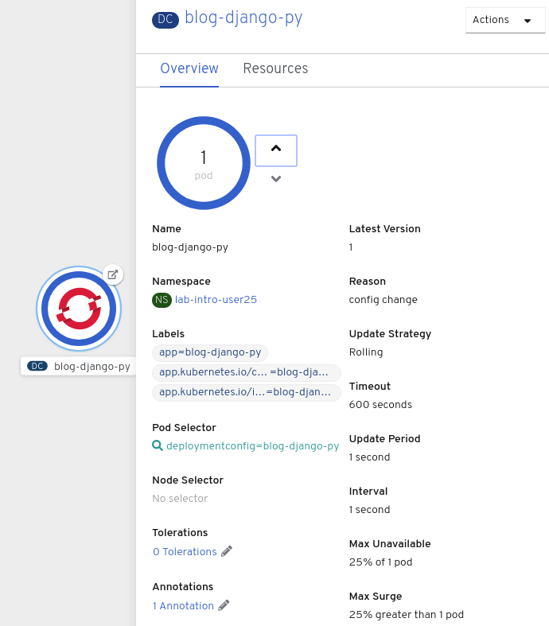
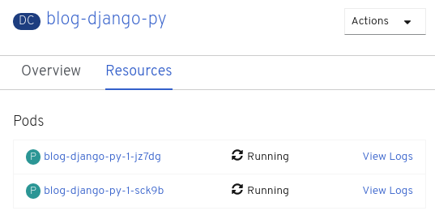
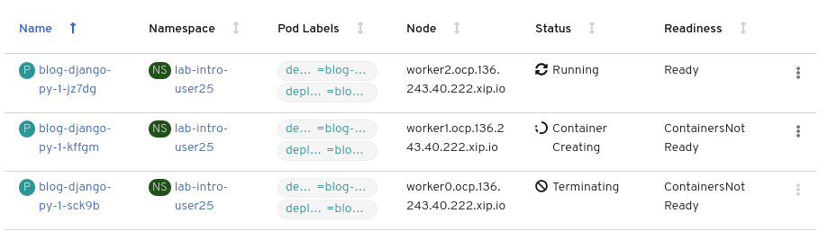

In these exercises you will learn to scale up an application, by increasing the number of *Pods* running which contain your application. You will also see what happens when you kill an instance of your application.


## Background: Containers and Pods

In OpenShift, the smallest deployable unit is a *Pod*. A *Pod* is a group of one or
more containers deployed together and guaranteed to be on the same host.

Each pod has its own IP address, therefore owning its entire port space, and
containers within pods can share storage. Pods can be "tagged" with one or
more labels, which are then used to select and manage groups of pods in a
single operation.

*Pods* can contain multiple containers. The general idea is for a Pod to
contain a "server" and any auxiliary services you want to run along with that
server. Examples of containers you might put in a *Pod* are, an Apache HTTPD
server, a log analyzer, and a file service to help manage uploaded files.

In the web console's overview page you will see that there is a single *Pod* that
was created by your actions. This *Pod* contains a single container, which
is the `blog-django` application.

You can also examine *Pods* from the command line:

```execute
oc get pods
```

You should see output that looks similar to:

```
NAME                      READY   STATUS      RESTARTS   AGE
blog-django-py-1-deploy   0/1     Completed   0          116s
blog-django-py-1-sck9b    1/1     Running     0          108s
```

The above output lists all of the *Pods* in the current *Project*, including the
*Pod* name, state, restarts, and uptime. To see more information about *Pods*, you can set the output type to *YAML* using the
`-o yaml` option.

```execute
oc get pods -o yaml
```

This will output a list with the details of all *Pods*. If you want to restrict the output to a single *Pod* pass the name of the *Pod* as argument to the ``oc get pod`` command.

When running ``oc get pods <POD name> -o yaml`` you should see output which starts with details similar to that below:

```
apiVersion: v1
kind: Pod
metadata:
  annotations:
    k8s.v1.cni.cncf.io/networks-status: |-
      [{
          "name": "openshift-sdn",
          "interface": "eth0",
          "ips": [
              "10.129.0.16"
          ],
          "dns": {},
          "default-route": [
              "10.129.0.1"
          ]
      }]
    openshift.io/deployment-config.latest-version: "1"
    openshift.io/deployment-config.name: blog-django-py
    openshift.io/deployment.name: blog-django-py-1
    openshift.io/generated-by: OpenShiftNewApp
    openshift.io/scc: restricted
  creationTimestamp: "2020-03-11T11:50:48Z"
  generateName: blog-django-py-1-
  labels:
    deployment: blog-django-py-1
    deploymentconfig: blog-django-py
  name: blog-django-py-1-sck9b
  namespace: lab-intro-user25
  ownerReferences:
  - apiVersion: v1
    blockOwnerDeletion: true
    controller: true
    kind: ReplicationController
    name: blog-django-py-1
    uid: 656aa3dd-a751-41cd-99fe-05b2fbf9e36b
  resourceVersion: "62542"
  selfLink: /api/v1/namespaces/lab-intro-user25/pods/blog-django-py-1-sck9b
  uid: 04447d63-a0e2-4dea-9900-a976e2802a0e
spec:
  containers:
  - image: openshiftkatacoda/blog-django-py@sha256:ec0149d51aac5db76abba4df956021c8d0f58b0e153160bd6b1eb8e967830bb5
    imagePullPolicy: Always
    name: blog-django-py
    ports:
    - containerPort: 8080
      protocol: TCP
    resources: {}
    securityContext:
      capabilities:
        drop:
        - KILL
        - MKNOD
        - SETGID
        - SETUID
      runAsUser: 1000620000
    terminationMessagePath: /dev/termination-log
    terminationMessagePolicy: File
    volumeMounts:
    - mountPath: /var/run/secrets/kubernetes.io/serviceaccount
      name: default-token-fnwfl
      readOnly: true
  dnsPolicy: ClusterFirst
  enableServiceLinks: true
  imagePullSecrets:
  - name: default-dockercfg-bswxv
  nodeName: worker0.ocp.136.243.40.222.xip.io
  priority: 0
  restartPolicy: Always
  schedulerName: default-scheduler
  securityContext:
    fsGroup: 1000620000
    seLinuxOptions:
      level: s0:c25,c10
  serviceAccount: default
  serviceAccountName: default
  terminationGracePeriodSeconds: 30
  tolerations:
  - effect: NoExecute
    key: node.kubernetes.io/not-ready
    operator: Exists
    tolerationSeconds: 300
  - effect: NoExecute
    key: node.kubernetes.io/unreachable
    operator: Exists
    tolerationSeconds: 300
  volumes:
  - name: default-token-fnwfl
    secret:
      defaultMode: 420
      secretName: default-token-fnwfl
    ...
```

The web interface also shows a lot of the same information on the *Pod* details
page. Click on the blue *Pod* circle on the project overview page. As there is only one *Pod* you will
be taken direct to the details page for the *Pod*. You can also get there by clicking _Applications_ in the left hand side navigation bar, then
_Pods_. This will give you a list of the *Pods* for the application. Click on the *Pod* name. If there was more than one *Pod* and you clicked in the *Pod* circle you would instead end up at the *Pod* list from which you can select which *Pod* to view.

## Background: Services

*Services* provide a convenient abstraction layer inside OpenShift to find a
group of like *Pods*. They also act as an internal proxy/load balancer between
those *Pods* and anything else that needs to access them from inside the
OpenShift environment. For example, if you needed to start up multiple instances of the `blog django` application to
handle the volume of requests to it, you could spin up more *Pods*. OpenShift automatically maps
them as endpoints to the *Service*, and the incoming requests would not notice
anything different except that the *Service* was now doing a better job handling
the requests.

When you asked OpenShift to run the image, it automatically created a *Service*
for you. Remember that services are an internal construct. They are not
available to the "outside world", or anything that is outside the OpenShift
environment. That's OK, as you will learn later.

The way that a *Service* maps to a set of *Pods* is via a system of *Labels* and
  *Selectors*. *Services* are assigned a fixed IP address and many ports and
protocols can be mapped.

Now that you understand the basics of what a *Service* is, let's take a look at
the *Service* that was created for the image that you just deployed.  In order to
view the *Services* defined in your *Project*, enter in the following command:

```execute
oc get services
```

You should see output similar to the following:

```
NAME             TYPE        CLUSTER-IP      EXTERNAL-IP   PORT(S)    AGE
blog-django-py   ClusterIP   172.30.150.52   <none>        8080/TCP   4m4s
```

In the above output, you can see that you have a *Service* named `blog-django-py` with an
IP/Port combination of 172.30.150.52/8080TCP. Your IP address may be different, as
each *Service* receives a unique IP address upon creation. *Service* IPs are
fixed and never change for the life of the *Service*.

In the web console, service information is available by clicking _Applications_ in the left hand side navigation bar
and then clicking _Services_.

You can also get more detailed information about a *Service* by using the
following command to display the data as YAML:

```execute
oc get service blog-django-py -o yaml
```

You should see output similar to the following:

```
apiVersion: v1
kind: Service
metadata:
  annotations:
    openshift.io/generated-by: OpenShiftNewApp
  creationTimestamp: "2020-03-11T11:50:38Z"
  labels:
    app: blog-django-py
    app.kubernetes.io/component: blog-django-py
    app.kubernetes.io/instance: blog-django-py
  name: blog-django-py
  namespace: lab-intro-user25
  resourceVersion: "62375"
  selfLink: /api/v1/namespaces/lab-intro-user25/services/blog-django-py
  uid: 6b80dd6a-f266-4b33-9c8d-1bd4466aaaf4
spec:
  clusterIP: 172.30.150.52
  ports:
  - name: 8080-tcp
    port: 8080
    protocol: TCP
    targetPort: 8080
  selector:
    deploymentconfig: blog-django-py
  sessionAffinity: None
  type: ClusterIP
status:
  loadBalancer: {}
```

Take note of the `selector` stanza.

```
selector:
  deploymentconfig: blog-django-py
```

Run again the command:

```execute
oc get pods -o yaml
```

Under the `metadata` section (of the Running POD, not the *deploy* POD) you should see the following:

```
labels:
    deployment: blog-django-py-1
    deploymentconfig: blog-django-py
```

The *Service* has a `selector` stanza that refers to `deploymentconfig: blog-django-py`.

The *Pod* has multiple *Labels*:

* `deployment: blog-django-py-1`

* `deploymentconfig: blog-django-py`


*Labels* are just key/value pairs. Any *Pod* in this *Project* that has a *Label* that
matches the *Selector* will be associated with the *Service*. To see this in
action, issue the following command:

```execute
oc describe service blog-django-py
```

You should see something like the following output:

```
Name:              blog-django-py
Namespace:         lab-intro-user25
Labels:            app=blog-django-py
                   app.kubernetes.io/component=blog-django-py
                   app.kubernetes.io/instance=blog-django-py
Annotations:       openshift.io/generated-by: OpenShiftNewApp
Selector:          deploymentconfig=blog-django-py
Type:              ClusterIP
IP:                172.30.150.52
Port:              8080-tcp  8080/TCP
TargetPort:        8080/TCP
Endpoints:         10.129.0.16:8080
Session Affinity:  None
Events:            <none>
```

You may be wondering why only one end point is listed. That is because there is
only one *Pod* currently running.  In the next set of exercises, you will learn how to scale
an application, at which point you will be able to see multiple endpoints
associated with the *Service*.

One last thing about services. Services are dinamically created while creating deploments, but it might be interesting to create manually services to point to external services (external to the OpenShift Cluster), because doing that we can use those external services in the same way that you use the OpenShift services with your applications running in the Cluster. This is interesting , for example, consider an application that you wish to containerize, which depends on an existing database service that is not readily available inside your OpenShift cluster. You do not need to migrate the database service to OpenShift before containerizing the application. Instead, begin designing your application to interact with OpenShift services, including the database service. Simply create an OpenShift service that references the external database service endpoints.

When you create OpenShift services for the endpoints of external services, your applications are able to discover both internal and external services. Additionally, if the endpoints of an external service change, then you do not need to reconfigure affected applications. Instead, update the endpoints for the corresponding OpenShift service.

If you want to create a OpenShift service pointing to an external service you can create a `externalname` type service, as in this example:

```
oc create service externalname myservice --external-name myhost.example.com
```


## Background: Deployments and Replication Controllers

While *Services* provide routing and load balancing for *Pods*, which may go in and
out of existence, *ReplicationControllers* (RC) are used to specify and then
ensure the desired number of *Pods* (replicas) are in existence. For example, if
you always want your application server to be scaled to 3 *Pods* (instances), a
*ReplicationController* is needed. Without a RC, any *Pods* that are killed or
somehow die/exit are not automatically restarted. *ReplicationControllers* are
how OpenShift "self heals".

Building on replication controllers, OpenShift adds expanded support for the
software development and deployment lifecycle with the concept of a *DeploymentConfig* (DC).
In the simplest case, a deployment just creates a new replication controller and
lets it start up pods. However, OpenShift deployments also provide the ability
to transition from an existing deployment of an image to a new one and also define hooks to be run before or after creating the replication controller.

In almost all cases, you will end up using the *Pod*, *Service*,
*ReplicationController* and *DeploymentConfig* resources together. And, in
almost all of those cases, OpenShift will create all of them for you.

##  Exploring the Objects Created by a Deployment

Now that you understand what a *ReplicatonController* and
*DeploymentConfig* are, you can explore how they work and are related. Take a
look at the *DeploymentConfig* (DC) that was created for you when you told
OpenShift to deploy the `blog-django-py` image. You can get a list of the *DeploymentConfig* objects in the current project by running:

```execute
oc get dc
```

This should output:

```
NAME                REVISION   DESIRED   CURRENT   TRIGGERED BY
blog-django-py   1          1         1         config,image(blog-django:1.2.0)
```

To get more details, you can look into the *ReplicationController* (RC).

Take a look at the *ReplicationController* (RC) that was created for you when
you told OpenShift to deploy the `blog-django-py` image. You can get a list of the *ReplicationController* objects in the current project by running:

```execute
oc get rc
```

This should output:

```
NAME                  DESIRED   CURRENT   READY   AGE
blog-django-py-1   1         1         1       14m
```

This lets you know that, right now, it is expected that one *Pod* should be running
(`Desired`), and that one *Pod* is actually deployed (`Current`). By changing
the desired number, you can tell OpenShift how many *Pods*, or instances of your application you want running.


## Scaling Up the Application using the CLI

To scale the application up to 2 instances you can use
the `oc scale` command. You could also do this by clicking the "up" arrow next to
the *Pod* circle in the OpenShift web console on the overview page. To use the command line run:

```execute
oc scale --replicas=2 dc/blog-django-py
```

To verify that the number of replicas has changed, run the ``oc get rc`` command.

```execute
oc get rc
```

```
NAME                  DESIRED   CURRENT   READY   AGE
blog-django-py-1   2         2         1       19m
```

You should see that you now have 2 replicas. Verify this by listing the *Pods*.

```execute
oc get pods
```

You should see two *Pods* listed, one being the *Pod* originally created when the application was first deployed, and the other one having just been created (it could take some time, while you will see *ContainerCreating* ).

```
NAME                         READY   STATUS      RESTARTS   AGE
blog-django-1-52nd9    1/1     Running     0          47s
blog-django-1-7kg4t    1/1     Running     0          19m
blog-django-1-deploy   0/1     Completed   0          19m
```

You can also verify that the *Service* now lists the two endpoints.

```execute
oc describe service/blog-django-py
```

You will see something like the following output:

```
Name:              blog-django
Namespace:         lab-intro-user25
Labels:            app=blog-django
                   app.kubernetes.io/component=blog-django
                   app.kubernetes.io/instance=blog-django
                   app.kubernetes.io/part-of=blog-django-app
Annotations:       openshift.io/generated-by: OpenShiftWebConsole
Selector:          app=blog-django,deploymentconfig=blog-django
Type:              ClusterIP
IP:                172.30.231.86
Port:              8080-tcp  8080/TCP
TargetPort:        8080/TCP
Endpoints:         10.129.0.15:8080,10.131.0.19:8080
Session Affinity:  None
Events:            <none>
```

Another way to get a list of the endpoints is by running:

```execute
oc get endpoints blog-django-py
```

You will see something like the following:

```
NAME                ENDPOINTS                           AGE
blog-django-py   10.129.0.15:8080,10.131.0.19:8080   20m
```

Your IP addresses will likely be different, as each pod receives a unique IP
within the OpenShift environment. The endpoint list is a quick way to see how
many pods are behind a service.


There is another way to use the CLI to scale an application, changing the `replicas` parameter inside the `deploymentconfig` (or `deployment` if using it instead of `deploymentconfig`). To make changes to an existing resource object you can use the ``oc edit`` command.

To edit the details of the ``deploymentconfig`` object for the sample application you can run:

```execute
oc edit deploymentconfig blog-django-py
```

This will start up an editor from which you can edit the definition of the resource object.

The ``vi`` editor will be used with this environment. If you are not familiar with ``vi``, you can enter ``:q`` to exit provided no changes have been made.

By default, when editing a definition, it will be provided as YAML. To edit the definition as JSON add the ``-o json`` option.

```execute
oc edit deploymentconfig blog-django-py -o json
```

Let's do it, check the number of replicas with the following command:

```execute
oc get deploymentconfig
```

It should show 1 replica (if you scaled down to 1 in the steps before):

```
NAME             REVISION   DESIRED   CURRENT   TRIGGERED BY
blog-django-py   3          1         1         config,image(blog-django-py:latest)
```

Now edit the object:


```execute
oc edit deploymentconfig blog-django-py
```

Change from:

```
...
spec:
  replicas: 1
...
```

to:

```
...
spec:
  replicas: 2
...
```

Once you are done with any edits, save the changes and quit the editor. The changes will be automatically uploaded and used to replace the original definition.

As OpenShift works on a declarative configuration model, the platform will then run any steps needed to bring the state of the cluster into agreement with the required state as defined by the resource object.

Do be aware that not all fields of a resource object are able to be changed. Some fields may be immutable. Others may represent the current state of the corresponding resource and any change will be overridden again with the current state.

Check again the number of replicas with the following command:

```execute
oc get deploymentconfig
```

It should show 1 replica (if you scaled down to 1 in the steps before):

```
NAME             REVISION   DESIRED   CURRENT   TRIGGERED BY
blog-django-py   3          2         2         config,image(blog-django-py:latest)
```

## Scaling Up the Application using the Web Console

Let's scale our application up to 2 instances of the pods. You can do this from the Web Console by clicking inside the circle for the `blog-django` application from *Topology* view to open the side panel. In the side panel, click the *Overview* tab, and then click the "up" arrow next to
the *Pod* in side panel.



To verify that we changed the number of replicas, click the *Resources* tab in the side panel. You should see a list with your pods similar to the image below:



You can see that we now have 2 replicas.

Overall, that's how simple it is to scale an application (*Pods* in a
*Service*). Application scaling can happen extremely quickly because OpenShift
is just launching new instances of an existing image, especially if that image
is already cached on the node.

## Application "Self Healing"

OpenShift's *DeploymentConfigs* are constantly monitoring to see that the desired number
of *Pods* is actually running. Therefore, if the actual state ever deviates from the desired state (i.e., 2 pods running), OpenShift will work to fix the situation.

Since we have two *Pods* running right now, let's see what happens if we
"accidentally" kill one.

On the *Resources* tab where you viewed the list of pods after scaling to 2 replicas, open one of the pods by clicking its name in the list.

In the top right corner of the page, there is an _Actions_ drop down menu. Click it and select *Delete Pod*.


After you click *Delete Pod*, click *Delete* in the confirmation dialog. You will be taken to a page listing pods, however, this time, there are three pods. Note that on smaller screens you may not see all of these columns.



The pod that we deleted is terminating (i.e., it is being cleaned up). A new pod was created because
OpenShift will always make sure that, if one pod dies, there is going to be new pod created to
fill its place.

## Scale Down

Before we continue, go ahead and scale your application down to a single
instance. Click *Topology* to return to the *Topology* view, then click `blog-django` and on the *Overview* tab, click the down arrow to scale back down to one instance.

## Idling the application

A related concept is application idling. OpenShift allows you to conserve resources by sleeping the application when not in use. When you try to use the application it will spin up the container automagically.

Run the following command to find the available endpoints

```execute
oc get endpoints 
```                                                                                                      
Output:

```
NAME             ENDPOINTS                           AGE
blog-django-py   10.129.2.23:8080,10.131.0.22:8080   48m
```

Note that the name of the endpoints is `blog-django-py` and there are three ip addresses for the pod.

Run the `oc idle` command to idle the application

```execute
oc idle endpoints/blog-django-py                                                                              
```

Output:

```
The service "lab-intro-user25/blog-django-py" has been marked as idled
The service will unidle DeploymentConfig "lab-intro-user25/blog-django-py" to 2 replicas once it receives traffic
DeploymentConfig "lab-intro-user25/blog-django-py" has been idled
```

Go back to the web console. You will notice that the pods show up as idled.

At this point the application is idled, the pods are not running and no resources are being used by the application. This doesn’t mean that the application is deleted. The current state is just saved.. that’s all.

Now click on the application route URL or access the application via curl.

Note that it takes a little while for the application to respond. This is because pods are spinning up again. You can notice that in the web console.

In a little while the output comes up and your application would be up with 3 pods (based on your replica count).

So, as soon as the user accesses the application, it comes up!!!


## POD Autoscaling

**NOTE:** This exercise, depending on the platform, could freeze the Workshop environment due the load generated. If that happens, try to click on the bars in the up-right corner and select *Reload Terminal*. If that does not work just reload the whole page.

Horizontal Pod AutoScaler (HPA) allows you to automatically scale your application based on the workload. It updates `replicacount` by watching the workload. 

HPA requires your pods to have requests and limits set so that it knows when to scale the application based on the consumption of resources.

Let us update the deployment to set the resources by running `oc set resources`

```execute
oc set resources dc blog-django-py --requests=cpu=200m --limits=cpu=500m
```

We have set the CPU request (initial allocation) as `200` millicores and limit (maximum allocation) to `500` millicores. So when we ask HPA to scale based on percentage workload, it measures based on these numbers.

Now we will create HPA by running `oc autoscale` command

```execute
oc autoscale dc blog-django-py --cpu-percent=50 --min=1 --max=10                                       
```
Here we are did two things:

* `cpu-percent=50` indicates that when the CPU usage (based on requests and limits) reaches 50%, HPA should spin up additional pods
* `--min=1 --max=10` sets upper and lower limits for the number of pods. We want to run minimum 1 pod and maximum it can scale up to 10 pods. Why? We cannot allow our application to consume all resources on the cluster.. right?

Now it is time to generate load and test

Get the URL for your application:

```execute
oc get route blog-django-py
```


Run `oc get hpa blog-django-py -w` to watch how the load goes up. After a little while once the application scale up to a few pods, stop the load by pressing `^C`. And you can watch the application scaling down:

```execute
oc get hpa blog-django-py -w
```

Open another terminal and login to the cluster. Make sure you are in the same project. And run the load generator pod from that terminal.

```execute-2
oc run --generator=run-pod/v1 -it --rm load-generator --image=busybox /bin/sh
```

If you don't see a command prompt after waiting 1 minute, try pressing enter.

This spins up a `busybox` image from where we will generate the load. 

and use that in the following command inside the load generator at the prompt


```execute-2
while true; do wget -q -O- http://blog-django-py-lab-intro-{{ username }}.{{ cluster_subdomain }} ; done
```

You will start seeking a bunch of `OK!` s as the load generator continuously hits the application.

You can also see the number of pods go up on webconsole

**NOTE** Scale up takes a few mins and so does Scale down. So be patient.

```
$ oc get hpa -w                                                                                                                          
NAME      REFERENCE            TARGETS         MINPODS   MAXPODS   REPLICAS   AGE                                                                                  
blog-django-py   Deployment/blog-django-py   <unknown>/50%   1         10        1          72s                                                                                  
blog-django-py   Deployment/blog-django-py   0%/50%          1         10        1          75s                                                                                  
blog-django-py   Deployment/blog-django-py   13%/50%         1         10        1          90s                                                                                  
blog-django-py   Deployment/blog-django-py   36%/50%         1         10        1          2m15s                                                                                
blog-django-py   Deployment/blog-django-py   69%/50%         1         10        1          2m30s                                                                                
blog-django-py   Deployment/blog-django-py   68%/50%         1         10        2          2m45s                                                                                
blog-django-py   Deployment/blog-django-py   95%/50%         1         10        2          3m                                                                                   
blog-django-py   Deployment/blog-django-py   94%/50%         1         10        2          3m15s                                                                                
blog-django-py   Deployment/blog-django-py   117%/50%        1         10        2          3m31s                                                                                
blog-django-py   Deployment/blog-django-py   124%/50%        1         10        3          3m46s                                                                                
blog-django-py   Deployment/blog-django-py   137%/50%        1         10        3          4m1s                                                                                 
blog-django-py   Deployment/blog-django-py   145%/50%        1         10        3          4m16s                                                                                
blog-django-py   Deployment/blog-django-py   150%/50%        1         10        3          4m31s                                                                                
blog-django-py   Deployment/blog-django-py   143%/50%        1         10        3          4m46s                                                                                
blog-django-py   Deployment/blog-django-py   144%/50%        1         10        3          5m1s                                                                                 
blog-django-py   Deployment/blog-django-py   143%/50%        1         10        3          5m16s                                                                                
blog-django-py   Deployment/blog-django-py   143%/50%        1         10        3          5m31s                                                                                
blog-django-py   Deployment/blog-django-py   149%/50%        1         10        3          5m46s                                                                                
blog-django-py   Deployment/blog-django-py   132%/50%        1         10        3          6m1s                                                                                 
blog-django-py   Deployment/blog-django-py   120%/50%        1         10        3          6m16s                                                                                
blog-django-py   Deployment/blog-django-py   107%/50%        1         10        3          6m31s                                                                                
blog-django-py   Deployment/blog-django-py   87%/50%         1         10        3          6m47s                                                                                
blog-django-py   Deployment/blog-django-py   82%/50%         1         10        3          7m2s                                                                                 
blog-django-py   Deployment/blog-django-py   53%/50%         1         10        3          7m17s                                                                                
blog-django-py   Deployment/blog-django-py   51%/50%         1         10        3          7m32s                                                                                
blog-django-py   Deployment/blog-django-py   29%/50%         1         10        3          7m47s                                                                                
blog-django-py   Deployment/blog-django-py   27%/50%         1         10        3          8m2s                                                                                 
blog-django-py   Deployment/blog-django-py   10%/50%         1         10        3          8m17s                                                                                
blog-django-py   Deployment/blog-django-py   2%/50%          1         10        3          8m32s                                                                                
blog-django-py   Deployment/blog-django-py   1%/50%          1         10        3          8m47s                                                                                
blog-django-py   Deployment/blog-django-py   0%/50%          1         10        3          9m2s                                                                                 
blog-django-py   Deployment/blog-django-py   0%/50%          1         10        3          12m                                                                                  
blog-django-py   Deployment/blog-django-py   0%/50%          1         10        2          12m                                                                                  
blog-django-py   Deployment/blog-django-py   0%/50%          1         10        2          13m                                                                                  
blog-django-py   Deployment/blog-django-py   0%/50%          1         10        1          13m
```


Stop the load: 

```execute-2
<ctrl-c>
```
... and the watch command:

```execute
<ctrl-c>
```

