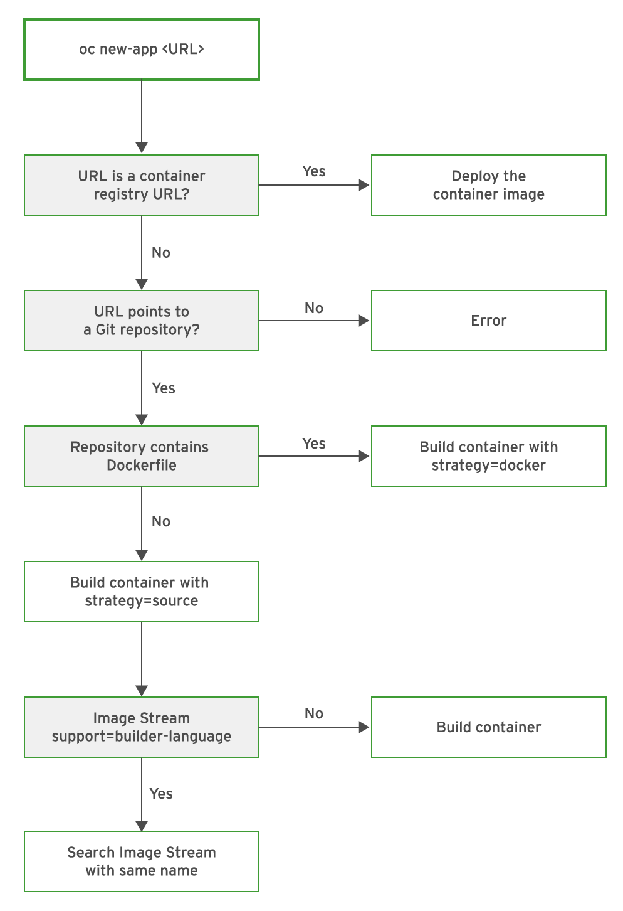


  


In the previous section we have seen how we can "inject" an already built binary into a build, but if you think about it, we didn't say anything about customizing the image where that binary/code is pushed. OpenShift can take a Dockerfile as an input and generates your application docker image for you. Let's try it.

Before we get started, be sure that you are in the right project in the CLI:

[source,bash,role="execute"]
----
oc project lab-intro-{{ username }}
----

## Create an application that uses docker file

This time we will use a project that has a Dockerfile in a source code repository. We will use a simple project on github
(https://github.com/RedHatWorkshops/time). The `rhel` folder from this github project is built starting with rhel7 as the base image which is
described in Dockerfile. Look at the Dockerfile for this project. It starts off with `registry.access.redhat.com/rhel7` image. It copies the
source code which is a simple `init.sh` file and exposes port `8080`.

Look at the `init.sh` that just displays the current datetime. There is also a PHP version of the same project available in the php folder if
you like to use that. The php version does exactly the same it has a `time.php` file that displays the time.

*Docker Build*: When OpenShift finds a Dockerfile in the source, it uses this Dockerfile as the basis to create a docker image for your application. This strategy is called `Docker Build` strategy on OpenShift. We’ll see more about it when we look at the build configuration a couple of steps down the line. Once OpenShift builds the application’s docker image, it stores that in a local docker registry.

Later it uses this image to deploy an application that runs in a pod.

Now let’s create an application using this approach. We will run `oc new-app` command by supplying the git uri as the parameter.

[source,bash,role="execute"]
----
oc new-app https://github.com/RedHatWorkshops/time --context-dir=rhel
----

This is the output:

----
--> Found container image 54a9312 (6 weeks old) from registry.access.redhat.com for "registry.access.redhat.com/r
hscl/httpd-24-rhel7"

    Apache httpd 2.4
    ----------------
    Apache httpd 2.4 available as container, is a powerful, efficient, and extensible web server. Apache supports
 a variety of features, many implemented as compiled modules which extend the core functionality. These can range
 from server-side programming language support to authentication schemes. Virtual hosting allows one Apache insta
llation to serve many different Web sites.

    Tags: builder, httpd, httpd24

    * An image stream tag will be created as "httpd-24-rhel7:latest" that will track the source image
    * A Docker build using source code from https://github.com/RedHatWorkshops/time will be created
      * The resulting image will be pushed to image stream tag "time:latest"
      * Every time "httpd-24-rhel7:latest" changes a new build will be triggered
    * This image will be deployed in deployment config "time"
    * Ports 8080/tcp, 8443/tcp will be load balanced by service "time"
      * Other containers can access this service through the hostname "time"

--> Creating resources ...
    imagestream.image.openshift.io "httpd-24-rhel7" created
    imagestream.image.openshift.io "time" created
    buildconfig.build.openshift.io "time" created
    deploymentconfig.apps.openshift.io "time" created
    service "time" created
--> Success
    Build scheduled, use 'oc logs -f bc/time' to track its progress.
    Application is not exposed. You can expose services to the outside world by executing one or more of the comm
ands below:
     'oc expose svc/time'
    Run 'oc status' to view your app.
----

You’ll notice that OpenShift created a few things at this point. You will find a buildconfig, deploymentconfig, service and imagestreams in the above list. The application is not running yet. It needs to be built and deployed. Within a minute or so, you will see that OpenShift starts the build.

## Build the Application

Have a look at the buildconfig by running:

[source,bash,role="execute"]
----
oc get bc time -o json
----

Output:

----
{
    "apiVersion": "build.openshift.io/v1",
    "kind": "BuildConfig",
    "metadata": {
        "annotations": {
            "openshift.io/generated-by": "OpenShiftNewApp"
        },
        "creationTimestamp": "2020-03-17T09:49:45Z",
        "labels": {
            "app": "time",
            "app.kubernetes.io/component": "time",
            "app.kubernetes.io/instance": "time"
        },
        "name": "time",
        "namespace": "lab-intro-{{ username }}",
        "resourceVersion": "304297",
        "selfLink": "/apis/build.openshift.io/v1/namespaces/lab-intro-{{ username }}/buildconfigs/time",
        "uid": "22726b0c-d6a3-49dc-8da5-486a405276f4"
    },
    "spec": {
        "failedBuildsHistoryLimit": 5,
        "nodeSelector": null,
        "output": {
            "to": {
                "kind": "ImageStreamTag",
                "name": "time:latest"
            }
        },
        "postCommit": {},
        "resources": {},
        "runPolicy": "Serial",
        "source": {
            "contextDir": "rhel",
            "git": {
                "uri": "https://github.com/RedHatWorkshops/time"
            },
            "type": "Git"
        },
        "strategy": {
            "dockerStrategy": {
                "from": {
                    "kind": "ImageStreamTag",
                    "name": "httpd-24-rhel7:latest"
                }
            },
            "type": "Docker"
        },
        "successfulBuildsHistoryLimit": 5,
        "triggers": [
            {
                "github": {
                    "secret": "X7ygU19P-ciEsuacb8g-"
                },
                "type": "GitHub"
            },
            {
                "generic": {
                    "secret": "LZSO-juolpmdDQAtu4DZ"
                },
                "type": "Generic"
            },
            {
                "type": "ConfigChange"
            },
            {
                "imageChange": {
                    "lastTriggeredImageID": "registry.access.redhat.com/rhscl/httpd-24-rhel7@sha256:32e50b54dccf8
47354e224d18ba58f39da053e351cf2377a9865206a43c5c62a"
                },
                "type": "ImageChange"
            }
        ]
    },
    "status": {
        "lastVersion": 1
    }
}
----

Note the name of the buildconfig in metadata is set to `time`, the git uri pointing to the value you gave while creating the application. Also note the Strategy.type set to `Docker`. This indicates that the build will use the instructions in this Dockerfile to do the docker build.

Build starts in a minute or so. You can view the list of builds using `oc get builds` command. You can also start the build using `oc start-build time` where ``time'' is the name we noticed in the buildconfig.

[source,bash,role="execute"]
----
oc get builds
----

Note the name of the build that is running i.e. time-1. We will use that name to look at the build logs. Run the command as shown below to look at the build logs. This will run for a few mins. At the end you will notice that the docker image is successfully created and it will start pushing this to OpenShift’s internal docker registry.

[source,bash,role="execute"]
----
oc logs build/time-1
----

Take a look to the logs:

----
Cloning "https://github.com/RedHatWorkshops/time" ...
        Commit: a89545e990a2041a43bd313296eee5f1ed9a44f0 (Update index.html)
        Author: Samuel Tauil <samueltauil@gmail.com>
        Date:   Tue Feb 19 19:26:49 2019 -0500
Replaced Dockerfile FROM image registry.access.redhat.com/rhscl/httpd-24-rhel7
Caching blobs under "/var/cache/blobs".

Pulling image registry.access.redhat.com/rhscl/httpd-24-rhel7@sha256:32e50b54dccf847354e224d18ba58f39da053e351cf2
377a9865206a43c5c62a ...
Getting image source signatures
Copying blob sha256:f1e56db67514d64aacc14367d514a44098bcafe117d4039444b90d1ea76c8fb4
Copying blob sha256:84e620d0abe585d05a7bed55144af0bc5efe083aed05eac1e88922034ddf1ed2
Copying blob sha256:bb13d92caffa705f32b8a7f9f661e07ddede310c6ccfa78fb53a49539740e29b
Copying blob sha256:455ea8ab06218495bbbcb14b750a0d644897b24f8c5dcf9e8698e27882583412
Copying config sha256:54a9312811c3e0d745a42a362d1931e4659c19a82ae384d0d71af8ff9a0a7bb8
Writing manifest to image destination
Storing signatures
STEP 1: FROM registry.access.redhat.com/rhscl/httpd-24-rhel7@sha256:32e50b54dccf847354e224d18ba58f39da053e351cf23
77a9865206a43c5c62a
STEP 2: ADD ./index.html /var/www/html
2a757d6f4a50a7c9ce52366c04393bc9a03f174e88936cbdb423e11ece839850
STEP 3: USER 1001
24469ca9b84c7342ae2e72dbc2aaeea16953b8b30af09d988918ba1d58d19af2
STEP 4: EXPOSE 8080
344e1423f77ea4c923a8a3c9386e7939fe9374706d30846726216c0feb9cd2f3
STEP 5: EXPOSE 8443
b06e5feead00abf1fdbe730bbf7d3340b15c885a377a85400c1c4d1f2113acd8
STEP 6: ENV "OPENSHIFT_BUILD_NAME"="time-1" "OPENSHIFT_BUILD_NAMESPACE"="lab-intro-{{ username }}" "OPENSHIFT_BUILD_SOURC
E"="https://github.com/RedHatWorkshops/time" "OPENSHIFT_BUILD_COMMIT"="a89545e990a2041a43bd313296eee5f1ed9a44f0"
0e891f001cfd7a8cdb68f69f429395ec6e7ab81c2eac2a1fea5cc11ee4cfcb0e
STEP 7: LABEL "io.openshift.build.commit.author"="Samuel Tauil \u003csamueltauil@gmail.com\u003e" "io.openshift.b
uild.commit.date"="Tue Feb 19 19:26:49 2019 -0500" "io.openshift.build.commit.id"="a89545e990a2041a43bd313296eee5
f1ed9a44f0" "io.openshift.build.commit.message"="Update index.html" "io.openshift.build.commit.ref"="master" "io.
openshift.build.name"="time-1" "io.openshift.build.namespace"="lab-intro-{{ username }}" "io.openshift.build.source-conte
xt-dir"="rhel" "io.openshift.build.source-location"="https://github.com/RedHatWorkshops/time"
STEP 8: COMMIT temp.builder.openshift.io/lab-intro-{{ username }}/time-1:c79b2f3d
2009734177d5bd7c4f4dca6f9d1bbb9422bfa4a507ce5c26baad1f37a84e0485
2009734177d5bd7c4f4dca6f9d1bbb9422bfa4a507ce5c26baad1f37a84e0485

Pushing image image-registry.openshift-image-registry.svc:5000/lab-intro-{{ username }}/time:latest ...
Getting image source signatures
Copying blob sha256:bb13d92caffa705f32b8a7f9f661e07ddede310c6ccfa78fb53a49539740e29b
Copying blob sha256:af186557a89c3b0b483075e5ceebf5c0838d69390f9ad32b686e607215df471b
Copying blob sha256:455ea8ab06218495bbbcb14b750a0d644897b24f8c5dcf9e8698e27882583412
Copying blob sha256:f1e56db67514d64aacc14367d514a44098bcafe117d4039444b90d1ea76c8fb4
Copying blob sha256:84e620d0abe585d05a7bed55144af0bc5efe083aed05eac1e88922034ddf1ed2
Copying config sha256:2009734177d5bd7c4f4dca6f9d1bbb9422bfa4a507ce5c26baad1f37a84e0485
Writing manifest to image destination
Storing signatures
Successfully pushed image-registry.openshift-image-registry.svc:5000/lab-intro-{{ username }}/time@sha256:c51fff708ad5b40
31da973efb891ccb9977f16ec0f0544421bb3e47766b82f0c
Push successful
----

In the above log note how the image is pushed to the local docker registry. The registry is running at `172.30.246.7` at port `5000`.

## Review the Deployment

Once the image is pushed to the docker registry, OpenShift will trigger a deploy process. Let us also quickly look at the deployment configuration by running the following command. Note dc represents deploymentconfig.

[source,bash,role="execute"]
----
oc get dc -o json
----

Output:

----
{
    "apiVersion": "v1",
    "items": [
        {
            "apiVersion": "apps.openshift.io/v1",
            "kind": "DeploymentConfig",
            "metadata": {
                "annotations": {
                    "openshift.io/generated-by": "OpenShiftNewApp"
                },
                "creationTimestamp": "2020-03-17T09:49:45Z",
                "generation": 2,
                "labels": {
                    "app": "time",
                    "app.kubernetes.io/component": "time",
                    "app.kubernetes.io/instance": "time"
                },
                "name": "time",
                "namespace": "lab-intro-{{ username }}",
                "resourceVersion": "304729",
                "selfLink": "/apis/apps.openshift.io/v1/namespaces/lab-intro-{{ username }}/deploymentconfigs/time",
                "uid": "1f70a580-df20-481e-bf82-67800116bb0c"
            },
            "spec": {
                "replicas": 1,
                "revisionHistoryLimit": 10,
                "selector": {
                    "deploymentconfig": "time"
                },
                "strategy": {
                    "activeDeadlineSeconds": 21600,
                    "resources": {},
                    "rollingParams": {
                        "intervalSeconds": 1,
                        "maxSurge": "25%",
                        "maxUnavailable": "25%",
                        "timeoutSeconds": 600,
                        "updatePeriodSeconds": 1
                    },
                    "type": "Rolling"
                },
                "template": {
                    "metadata": {
                        "annotations": {
                            "openshift.io/generated-by": "OpenShiftNewApp"
                        },
                        "creationTimestamp": null,
                        "labels": {
                            "deploymentconfig": "time"
                        }
                    },
                    "spec": {
                        "containers": [
                            {
                                "image": "image-registry.openshift-image-registry.svc:5000/lab-intro-{{ username }}/time@
sha256:c51fff708ad5b4031da973efb891ccb9977f16ec0f0544421bb3e47766b82f0c",
                                "imagePullPolicy": "Always",
                                "name": "time",
                                "ports": [
                                    {
                                        "containerPort": 8080,
                                        "protocol": "TCP"
                                    },
                                    {
                                        "containerPort": 8443,
                                        "protocol": "TCP"
                                    }
                                ],
                                "resources": {},
                                "terminationMessagePath": "/dev/termination-log",
                                "terminationMessagePolicy": "File"
                            }
                        ],
                        "dnsPolicy": "ClusterFirst",
                        "restartPolicy": "Always",
                        "schedulerName": "default-scheduler",
                        "securityContext": {},
                        "terminationGracePeriodSeconds": 30
                    }
                },
                "test": false,
                "triggers": [
                    {
                        "type": "ConfigChange"
                    },
                    {
                        "imageChangeParams": {
                            "automatic": true,
                            "containerNames": [
                                "time"
                            ],
                            "from": {
                                "kind": "ImageStreamTag",
                                "name": "time:latest",
                                "namespace": "lab-intro-{{ username }}"
                            },
                            "lastTriggeredImage": "image-registry.openshift-image-registry.svc:5000/lab-intro-use
r19/time@sha256:c51fff708ad5b4031da973efb891ccb9977f16ec0f0544421bb3e47766b82f0c"
                        },
                        "type": "ImageChange"
                    }
                ]
            },
            "status": {
                "availableReplicas": 1,
                "conditions": [
                    {
                        "lastTransitionTime": "2020-03-17T09:50:53Z",
                        "lastUpdateTime": "2020-03-17T09:50:53Z",
                        "message": "Deployment config has minimum availability.",
                        "status": "True",
                        "type": "Available"
                    },
                    {
                        "lastTransitionTime": "2020-03-17T09:50:54Z",
                        "lastUpdateTime": "2020-03-17T09:50:54Z",
                        "message": "replication controller \"time-1\" successfully rolled out",
                        "reason": "NewReplicationControllerAvailable",
                        "status": "True",
                        "type": "Progressing"
                    }
                ],
                "details": {
                    "causes": [
                        {
                            "type": "ConfigChange"
                        }
                    ],
                    "message": "config change"
                },
                "latestVersion": 1,
                "observedGeneration": 2,
                "readyReplicas": 1,
                "replicas": 1,
                "unavailableReplicas": 0,
                "updatedReplicas": 1
            }
        }
    ],
    "kind": "List",
    "metadata": {
        "resourceVersion": "",
        "selfLink": ""
    }
}
----

Note where the image is picked from. It shows that the deployment picks the image from the local registry (same ip address and port as in buildconfig) and the image tag is same as what we built earlier. This means the deployment step deploys the application image what was built earlier during the build step.

If you get the list of pods, you’ll notice that the application gets deployed quickly and starts running in its own pod.

[source,bash,role="execute"]
----
oc get pods
----
You should see something like this:

----
NAME            READY   STATUS      RESTARTS   AGE
time-1-build    0/1     Completed   0          3m45s
time-1-deploy   0/1     Completed   0          3m4s
time-1-sk65g    1/1     Running     0          2m56s
----

## Exposing the application

This step is very much the same as what we did in the previous exercise. We will check the service and add a route to expose that service.

[source,bash,role="execute"]
----
oc get services
----

Here we expose the service as a route.

[source,bash,role="execute"]
----
oc expose service time
----

And then we check the route exposed.

[source,bash,role="execute"]
----
oc get routes
----

## Check the running application

Now run the application by using the route you provided in the previous step. You can use either curl or your browser. The application displays this message:* "Congratulations you just deployed your app by using a Docker build strategy!"

[source,bash,role="execute"]
----
curl http://time-lab-intro-{{ username }}.{{ cluster_subdomain }}
----

## Mixing Dockerfile and binary builds 

Let's do it a little bit more interesting than just use one of the deployment that We already reviewed, let's mix a couple of them binary+ Dockerfile builds. In this example We will be using a source-to-image but deploying a binary and at the same time using a custom Dockerfile where we get the binary file in a `RUN` statement (That's slightly different form the binary example that we did in another module). 

Here we have to add an additional step to the ones reviewed during the "Deploying application with binary files" module because We have to create two sources for the same build, one first source that is the custom Docker file and a second one that is the binary file. 

If we try to use the `oc new-build` to mix both binary and Dcokerfile builds,  We will face this error:

----
$ oc new-build --binary=true -D $'FROM openshift/wildfly-101-centos7:latest\nCOPY ROOT.war /wil
dfly/standalone/deployments/ROOT.war\nCMD $STI_SCRIPTS_PATH/run' --name=jpetstore
error: specifying binary builds and source repositories at the same time is not allowed
----

So since you cannot do both using the `oc new-build` command We can either create a yaml file for this build and create it from there, or create a Dockerfile build and then path that build to include the second source (binary). We will be doing the later so you can see the error that We get if we try to use that Dockerfile that expects a ROOT.war that is not there in the image (because at that point we are not injecting any binary)

### Create a new buildconfig with a Dockerfile

First let's create a new build with a custom Dockerfile. In order to change a little bit the example of the "Deploying with custom Dockerfile", this time We are going to inject the Dockerfile as an inline parameter.

[source,bash,role="execute"]
----
oc new-build -D $'FROM openshift/wildfly-101-centos7:latest\nCOPY ROOT.war /wildfly/standalone/deployments/ROOT.war\nCMD $STI_SCRIPTS_PATH/run' --name=jpetstore 
----

If you check the created BuildConfig 

[source,bash,role="execute"]
----
oc get bc jpetstore -o yaml
----

...you will see how the source is just a Dockerfile

----
..
..
  source:
    dockerfile: |-
      FROM openshift/wildfly-101-centos7:latest
      COPY ROOT.war /wildfly/standalone/deployments/ROOT.war
      CMD $STI_SCRIPTS_PATH/run
    type: Dockerfile
..
..
----

Taking a look to the builds, you will see how the build failed because the Dockerfile is expecting a root.WAR file that is not in the image since we didn't injected yet

[source,bash,role="execute"]
----
oc get build
----

[source,bash,role="execute"]
----
oc logs jpetstore-1-build
----

Output

----
..
..

STEP 1: FROM openshift/wildfly-101-centos7@sha256:7775d40f77e22897dc760b76f1656f67ef6bd5561b4d74fbb030b977f61d48e8
STEP 2: COPY ROOT.war /wildfly/standalone/deployments/ROOT.war
error: build error: error dry-running "COPY ROOT.war /wildfly/standalone/deployments/ROOT.war": no files found matching "/tmp/b
uild/inputs/ROOT.war": no such file or directory
----

### Include the binary source in the BuildConfig

In order to inject the binary file we need to add another source for this buildconfig, you can use `oc edit bc` or just a path like this one

[source,bash,role="execute"]
----
oc patch  bc jpetstore -p '{"spec":{"source":{"binary":{"asFile":"ROOT.war"}}}}'
----

Check the changes

[source,bash,role="execute"]
----
oc get bc jpetstore -o yaml
----

Now there are two sources: the Dockerfile to customize the image and the binary because our image customization needs a binary file that must be injected while invoking the build

----
..
..
  source:
    binary:
      asFile: ROOT.war
    dockerfile: |-
      FROM openshift/wildfly-101-centos7:latest
      COPY ROOT.war /wildfly/standalone/deployments/ROOT.war
      CMD $STI_SCRIPTS_PATH/run
    type: Binary
..
..
----

### Get the binary file (this time We will compile it instead of just download it)

This time we are going to get the code and compile it locally this first time (in our example in the "Deployment with binary files" modules we just downloaded the pre-compiled WAR file)

[source,bash,role="execute"]
----
curl -O https://raw.githubusercontent.com/RedHatWorkshops/ps/master/deployments/ROOT.war
----

### Execute the build to generate the ImageStream including the binary file

Run the build

[source,bash,role="execute"]
----
oc start-build jpetstore --from-file=ROOT.war --wait=true
----

Now a new build is trigger. 

[source,bash,role="execute"]
----
oc get build
----

----
$ oc get build
NAME                     TYPE     FROM         STATUS                       STARTED          DURATION
jpetstore-1   Docker   Dockerfile   Failed (DockerBuildFailed)   5 minutes ago    55s
jpetstore-2   Docker   Binary       Complete                     2 minutes ago   56s
----

You can see the difference between the first build that it said that is was just from "Dockerfile" and this one that finished that comes from "Binary" (although it is getting the custom Dockerfile too)

### Deploy the application and test it

First deploy using the generated ImageStream

[source,bash,role="execute"]
----
oc new-app jpetstore 
----

Then expose the application

[source,bash,role="execute"]
----
oc expose svc/jpetstore
----

Wait until the POD is Running

[source,bash,role="execute"]
----
oc get pod
----

At this point you can test the application

[source,bash,role="execute"]
----
oc get routes
----

http://jpetstore-lab-intro-{{ username }}.{{ cluster_subdomain }}

